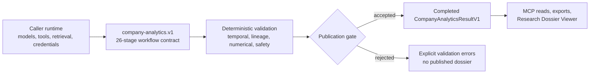

# StockResearchAgents

<!-- mcp-name: io.github.harshitagarwal2/stock-research-agents -->

[](https://github.com/harshitagarwal2/StockResearchAgents/actions/workflows/ci.yml)
[](pyproject.toml)
[](LICENSE)
[](docs/INTEGRATION.md#mcp)

Evidence-first company research for agent harnesses, with versioned contracts, deterministic validation and analytics, durable lifecycle controls, and completed-only dossiers.

> **Prototype research only. Not financial advice.** StockResearchAgents has no broker integration and cannot submit, modify, approve, cancel, or fill an order. Investment-style output is explicitly non-executable (`non_executable: true`); it is an analytical scenario, never an action.

StockResearchAgents gives an MCP-capable harness or custom application a strict research workflow without choosing its model provider, prompt runtime, retrieval stack, or agent scheduler. The caller supplies evidence and reasoning; the core validates the typed result, preserves provenance and limitations, and publishes only a completed dossier.

[](assets/architecture/system-overview.svg)

## Verify it locally

Python 3.11+ and [`uv`](https://docs.astral.sh/uv/) are recommended. From a source checkout:

```bash
uv sync
uv run python scripts/smoke_backend.py
```

Expected output has this shape:

```text
ok run=analytics-… stages=26 events=34
```

This CI-backed smoke check publishes the deterministic, credential-free ORCL test submission through the completed-result path. It proves contract and publication behavior—not live retrieval, research quality, forecast calibration, or investment performance.

To inspect the public workflow contract without running a model or retrieving data:

```bash
uv run stock-research-agents analytics-plan \
  --input examples/company-request.v1.json \
  --output plan.json
```

The example request is explicitly fixture-mode. Changing its symbol does not make it live. See [Getting started](docs/GETTING_STARTED.md) for the complete first-run explanation.

## What you get

| Capability | What StockResearchAgents guarantees |
| --- | --- |
| Evidence and claims | Typed source identity, timestamps, entitlements, lineage, coverage gaps, claims, counterclaims, and limitations |
| Analytics and valuation | Deterministic fundamentals, ratios, valuation cases, sensitivities, consensus, positioning, and catalyst records |
| Risks and counterevidence | Structured challenge, risk scenarios, unresolved evidence, and falsifiable hypotheses |
| Monitoring and quality | Forecasts, later outcome observations, deterministic scorecards, and research-change records |
| Durable lifecycle | A 26-stage `run-control.v1` flow with checkpoints, optimistic revisions, pause/resume, cancellation, recovery, and atomic finalization |
| Completed presentation | Five report groups, JSON/Markdown exports, MCP reads, and a loopback-only Research Dossier Viewer that never sees partial stage output |

The one public product profile is `company-analytics.v1`. Its strict terminal result, `CompanyAnalyticsResultV1`, retains the exact submission and seven authoritative artifacts: dossier, analytics bundle, run card, hypothesis ledger, research iterations, quality receipt, and forecast set.

## How it works



1. A caller validates a request and receives versioned roles, dependencies, capabilities, completion criteria, and output schemas.
2. The caller retrieves cutoff-valid evidence and executes the stages with its own agents and tools.
3. StockResearchAgents validates the complete terminal submission and its cross-references.
4. Only an accepted, atomically published result becomes readable through MCP, exports, or the viewer.

[Architecture](docs/ARCHITECTURE.md) explains the ports-and-adapters boundaries, lifecycle state machine, repositories, projections, and security invariants.

## Interfaces

| Interface | Entry point | Use it for |
| --- | --- | --- |
| CLI | `stock-research-agents` | Plans, imports, durable run control, validation, exports, memory, quality, and viewer serving |
| Coordination MCP | `stock-research-agents-mcp` | Capability discovery, planning, lifecycle mutation, publication, and completed-result reads |
| Research-data MCP | `stock-research-data-mcp` | Typed SEC, GDELT, World Bank, and read-only Polymarket source routes |
| Python | `stock_research_agents` | Embedding contracts, application services, lifecycle control, and projections |
| Host adapters | `stock_research_agents_host` | Caller-owned source collection, entitlements, and provider normalization |

The coordination MCP intentionally registers no research-data tools. Credentials, raw licensed bodies, provider sessions, prompt text, model execution, and agent scheduling remain outside the core boundary.

## Source and proof status

| Source route | Default status | Important limitation |
| --- | --- | --- |
| SEC filings, fundamentals, statements | Public typed route | Availability and point-in-time validity still require exact-cutoff checks |
| GDELT company/global news | Public discovery route | Publisher links are discovery metadata, not opened publisher evidence |
| World Bank macro observations | Public typed route | Current-vintage values do not reconstruct historical revision lineage |
| Polymarket Gamma | Public read-only context | Market-implied observations are neither forecast truth nor executable signals |
| Prices and indicators | Caller-entitled port | No bundled default licensed market-data provider |
| Reddit | Caller OAuth port | Requires approved caller credentials and rights |
| StockTwits | Not registered | No silent fallback |

StockResearchAgents therefore has partial live public-source coverage, not complete live company research. Missing, stale, conflicting, or entitlement-blocked evidence remains visible. See the [source portfolio](docs/SOURCE_PORTFOLIO.md), [research-data MCP](docs/RESEARCH_DATA_MCP.md), and [proof ledger](docs/FEATURE_PARITY.md).

## Install and integrate

No public release is claimed until a tagged version has been published. For development, use the source-checkout commands above. Once a release exists, the supported PyPI, GitHub Release, MCP, and host-specific commands will be listed in [Harnesses](docs/HOSTS.md) and verified through the [release process](docs/RELEASING.md).

| Goal | Start here |
| --- | --- |
| Connect an MCP-capable harness | [Integration](docs/INTEGRATION.md#mcp) |
| Use Claude Code, OpenCode, Hermes, or the optional Codex adapter | [Host adapters](docs/INTEGRATION.md#host-adapters) |
| Embed the Python API | [Python integration](docs/INTEGRATION.md#python) |
| Build a source adapter | [Ports and adapters](docs/PORTS_AND_ADAPTERS.md) |
| Operate or recover durable runs | [Operations](docs/OPERATIONS.md) |
| Review contracts and compatibility | [Contracts](docs/CONTRACTS.md) and [compatibility](docs/COMPATIBILITY.md) |
| Understand product and UI decisions | [Design](DESIGN.md) |

The complete documentation index is in [docs/README.md](docs/README.md).

## Stable product language

| Human-facing name | Stable technical identifier |
| --- | --- |
| Company Analytics | `company-analytics.v1` |
| Completed Research Dossier | `research_dossier.v1` |
| Research Dossier Viewer | `run-view.v1` |
| Evidence-First Company Research foundation | `company-research.v1` |
| Research Quality sidecar | `research_quality.v1` |
| Research Quality Receipt | `research-quality.v1` |

Wire identifiers are versioned and are not cosmetically renamed. See the [glossary](docs/GLOSSARY.md).

## Contributing, support, and security

- Read [CONTRIBUTING.md](CONTRIBUTING.md) before changing a contract, workflow, source adapter, or presentation boundary.
- Use [SUPPORT.md](SUPPORT.md) for usage questions and troubleshooting routes.
- Report vulnerabilities through the private process in [SECURITY.md](SECURITY.md), not a public issue.
- Review user-visible changes in [CHANGELOG.md](CHANGELOG.md).

Licensed under the [Apache License 2.0](LICENSE).
