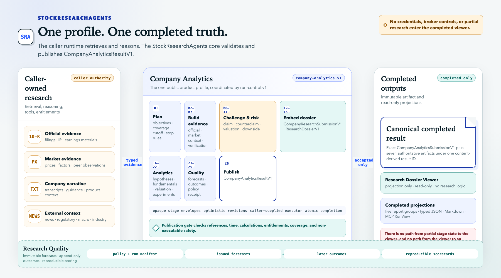

# StockResearchAgents

Evidence-first company research that preserves what was known, why a conclusion was reached, and how the completed work can be audited.

Evidence-first company research for agent harnesses, with versioned contracts, deterministic analytics, durable lifecycle controls, and completed-only dossiers.

> **Prototype research only. Not financial advice.** StockResearchAgents has no broker integration and cannot submit, modify, approve, cancel, or fill an order.

## Harness-neutral research capability

StockResearchAgents is an independent capability bundle for MCP-capable agent harnesses and custom applications. A **research host** retrieves evidence, runs models, invokes tools, and schedules agents. StockResearchAgents supplies the harness-neutral workflow contracts, deterministic validation and analytics, durable stage lifecycle, atomic publication, portable exports, and completed-only presentation. It does not prescribe a model provider, prompt runtime, or agent scheduler. Codex is an optional thin adapter, not a platform dependency.

[](assets/architecture/system-overview.png)

[Open the full-resolution system overview.](assets/architecture/system-overview.png)

The primary `company-analytics.v1` profile adds deterministic fundamentals, valuation, consensus, positioning, catalysts, experiments, falsifiable hypotheses, forecasts, and outcome scoring to the evidence-first dossier. The portable core validates exact-cutoff contracts, atomically publishes the completed bundle, and serves a read-only **Research Dossier Viewer**.

The boundary is deliberate:

- **The host owns** retrieval, reasoning, credentials, entitlements, tool invocation, exact prompt wording, and agent scheduling.
- **Portable owns** versioned stage roles/objectives/completion-criteria declarations, contracts, deterministic conformance, stage boundaries, recovery, terminal validation, publication, exports, and completed read models. A host attests intermediate criterion satisfaction; opaque nonterminal content remains host-owned and is not called verified by Portable.
- **The viewer owns no research logic.** It remains empty until a completed result is published.

## Five-minute safe demo

Python 3.11+ and [`uv`](https://docs.astral.sh/uv/) are recommended.

```bash
uv sync
uv run stock-research-agents fixture --events
```

Open the returned `presentation.url`. Completed CLI and MCP operations automatically ensure one shared loopback viewer
and return a URL pinned to that exact run; later companies reuse the same application. The ORCL data is deterministic
fixture material and is visibly labeled as such; it does not claim to be current market research. The foreground
`report` command remains available for diagnostics or an explicitly selected port.

## Five-minute deterministic proof

Python 3.11+ and [`uv`](https://docs.astral.sh/uv/) are recommended.

```bash
uv sync
uv run stock-research-agents fixture --events
```

This command exercises the local CLI adapter against the deterministic ORCL fixture. It proves the portable contracts and completed-result path; it does not run live retrieval or establish the CLI as the research runtime. Open the returned `presentation.url` to inspect the exact completed run in the shared loopback viewer.

For normal research, start from a host integration. Codex can use the packaged skill and MCP servers; other harnesses can use MCP, Python, or their own adapter over the same contracts. See [Harness integration](docs/INTEGRATION.md). Compatibility command names are documented separately in [Compatibility](docs/COMPATIBILITY.md).

## Choose your path

| Goal | Start here |
| --- | --- |
| See the product safely | [Getting started](docs/GETTING_STARTED.md) |
| Use the Codex plugin | [Harness integration](docs/INTEGRATION.md#codex-plugin) |
| Connect any MCP-capable harness | [Harness integration](docs/INTEGRATION.md#mcp) |
| Build a durable host adapter | [Contract guide](docs/CONTRACTS.md) and [Architecture](docs/ARCHITECTURE.md) |
| Improve source breadth and independence | [Source portfolio](docs/SOURCE_PORTFOLIO.md) |
| Understand SOLID and ports/adapters boundaries | [Ports and adapters](docs/PORTS_AND_ADAPTERS.md) |
| Operate, export, or troubleshoot runs | [Operations](docs/OPERATIONS.md) |
| Understand product and UI decisions | [Design](DESIGN.md) |
| Review forecast accountability | [Research Quality](docs/RESEARCH_QUALITY.md) |
| Contribute safely | [Contributing](CONTRIBUTING.md) |

The complete documentation map is in [docs/README.md](docs/README.md).

## What exists today

The implemented **Company Analytics** capability provides:

- an exact, timezone-aware research cutoff;
- first-class source, entitlement, timestamp, claim, calculation, peer, valuation, risk, monitoring, and coverage records;
- a 26-stage host-executed workflow with a locally ready compatible sequential runner, a full native-agent adapter contract, a partial coordination/import tools-only mode, and a mandatory sequential fallback;
- deterministic fundamentals, ratios, valuation cases, consensus, positioning, catalysts, point-in-time experiment receipts, hypotheses, forecasts, and reproducible outcome scorecards;
- strict temporal, referential, numerical, debate, portfolio, licensing, and safety validation;
- SQLite/WAL lifecycle checkpoints with optimistic revisions, pause/resume, cooperative cancellation, and recovery;
- content-addressed completed results and atomic publication;
- JSON/Markdown exports, harness and MCP reads, and an automatically discovered, shared loopback-only Research Dossier Viewer with exact source identity/access states, deduplicated planned-versus-held coverage, publisher/host concentration, entitlement gaps, and claim-lineage analysis.

The separate `tradingagents-research-data` compatibility server key implements SourceBatch v1 and registers six public tools by default: SEC filings/fundamentals/statements, GDELT company/global news discovery metadata plus publisher links, and World Bank macro observations. The coordination MCP remains isolated from data retrieval. Prices and indicators require an entitled host `SourcePort`, Reddit requires host OAuth, and StockTwits is denied/unregistered. The World Bank API supplies current-vintage values and cannot reconstruct historical revision lineage. GDELT results are discovery records—not opened publisher evidence—and saturated result sets are reported as partial.

Portable therefore has partial live public-source coverage, not complete live company research. Live correctness still depends on source availability, host entitlements, model behavior, exact-cutoff discipline, and the missing market-data/social provider coverage.
The public `run_sequential_company_lifecycle` fallback is the locally ready execution path: it drives the same 26 durable stage contracts through one host executor and resumes at the first incomplete stage. Full native-agent execution remains host-adapter work, and tools-only execution remains partial because live research provider coverage is incomplete. Native multi-agent harnesses may schedule the same contracts differently without changing their observable meaning.

## Company research from a host

Plan the primary analytics flow from a v3-compatible company request:

The example below uses the CLI as a thin local adapter. Codex, MCP, Python, and custom harness adapters consume the same plan and terminal contract without inheriting CLI orchestration.

```bash
uv run stock-research-agents analytics-plan \
  --input examples/company-request.v3.json \
  --output plan.json
```

A host executes the returned versioned roles, objectives, completion criteria, dependencies, capabilities, and output contracts with its own agents and tools. It may then import a complete, schema-valid terminal submission:

```bash
uv run stock-research-agents analytics-import \
  --input submission.v4.json \
  --output result.json
```

For a durable 26-stage run, use `analytics-init`, then the shared host/run lifecycle controls. Opaque nonterminal envelopes are recorded as `committed`, not independently verified stage completions. Commits advance one first-incomplete stage at a time, resume restarts there, and finalization validates the exact canonical 26-stage run card and v4 bundle before atomically publishing authoritative `RunResult` sidecars. The recoverable quality outcome index is reconstructed from those completed artifacts when necessary. `analytics-import` remains the stateless seam for an already-complete v4 payload. See [Integration](docs/INTEGRATION.md).

## Stable product language

| Human-facing name | Meaning | Stable technical identifier |
| --- | --- | --- |
| Company Analytics | Primary research capability | `company-analytics.v1` |
| Completed Research Dossier | Immutable human-facing artifact | `research_dossier.v3` |
| Research Dossier Viewer | Completed-only read projection | compatibility APIs still use `dashboard` |
| Evidence-First Company Research | Frozen dossier foundation | `company-research.v2` |
| Research Quality | Forecast, outcome, and evaluation capability | `research_quality.v1` sidecar in `company-analytics.v1` |
| Research Quality Receipt | Immutable policy, provenance, forecast, and rule-evaluation artifact | `research-quality.v1` |
| Legacy TradingAgents Compatibility Workflow | Preserved compatibility workflow | `financial-research.v1` |

Wire identifiers remain versioned and are never renamed cosmetically. See [Glossary](docs/GLOSSARY.md) and [Compatibility](docs/COMPATIBILITY.md).

## Versioned compatibility

| Surface | Status | Purpose |
| --- | --- | --- |
| `company-analytics.v1` | Primary implemented profile | Twenty-six-stage dossier, analytics, research-lab, and quality workflow |
| `host-submission.v4` | Implemented wrapper | Unchanged v3 submission plus typed analytics and quality sidecars |
| `company-research.v2` | Implemented foundation | Fifteen-stage Evidence-First Company Research workflow |
| `host-submission.v3` | Implemented and frozen | Strict request plus completed `research_dossier.v3` |
| `financial-research.v1` | Preserved compatibility profile | Legacy analyst/debate/trader/risk/portfolio workflow |
| `host-submission.v2` | Preserved and frozen | Terminal format for the compatibility path |
| `run-lifecycle.v1` | Preserved | Durable lifecycle protocol shared with the compatibility path |

The analytics profile wraps rather than widens v3. Existing v3 readers remain valid while v4-aware readers consume typed sidecars.

## TradingAgents reference and compatibility

The specialized research roles, adversarial discussion, and risk-review ideas in [TradingAgents](https://github.com/TauricResearch/TradingAgents) and [*TradingAgents: Multi-Agents LLM Financial Trading Framework*](https://arxiv.org/abs/2412.20138) are reference points and sources of inspiration. StockResearchAgents independently expresses those broad ideas as harness-neutral contracts and application services; it is not a fork, replacement, or CLI wrapper around TradingAgents, and it does not copy upstream prompts, workflow business logic, providers, or persistence internals.

Upstream remains external and intact. An exact revision is used only as a scoped compatibility oracle and by an opt-in adapter. Portable conformance passes or fails on StockResearchAgents' own contracts; the report exposes upstream compatibility as a separate verified, unverified, or incompatible status. The adapter is excluded from the default credential-free plugin and is not part of the portable core. Its current support and eventual removal gates are maintained in [Compatibility](docs/COMPATIBILITY.md) and [Legacy transition](docs/LEGACY_TRANSITION.md).

## Current proof boundary

Local tests prove deterministic contracts, lifecycle behavior, safety, and generic symbol handling for fixture submissions. They do not prove:

- that every future host retrieves complete or correct live evidence;
- access to licensed providers or redistribution rights;
- recommendation quality, investment performance, or forecast calibration;
- token-level resume inside a model response or tool call; or
- broker or order execution, which is prohibited.

See [Capability and proof status](docs/FEATURE_PARITY.md) and [Validation](docs/VALIDATION.md) for the evidence ledger.
