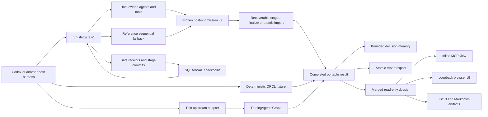

# TradingAgents Portable architecture

## Purpose

This repository is an incubation environment for running TradingAgents-compatible research through a durable portable CLI/MCP boundary and presenting the finalized output as a read-only dossier.

The portable layer owns workflow contracts, validation, and projection, not model inference. The active host harness can execute the complete workflow with its own internal agents; optional legacy execution remains owned by upstream `TradingAgentsGraph`.

## Boundary

TradingAgents Portable owns:

- versioned run, workflow, event, evidence, decision, artifact, and dashboard contracts;
- the deterministic ORCL demonstration fixture;
- harness-neutral MCP tools and a Codex plugin/skill bundle;
- a separate `run-lifecycle.v1` stage-control protocol and frozen `host-submission.v2` terminal dossier, neither of which accepts model credentials;
- private SQLite/WAL lifecycle checkpoints, optimistic revisions, atomic canonical result/event bundles, safe cursor-readable receipts, cooperative cancellation, and stage-boundary resume;
- publication-gated SQLite decision memory: up to five same-symbol and three cross-symbol published records plus append-only later outcomes/reflections;
- an upstream-compatible report export with atomic first publication, journaled crash-recoverable overwrite, structured result/events, optional sanitized lifecycle JSONL, and SHA-256 digests;
- versioned per-stage context/tool/output contracts, capability negotiation, interactive portable CLI commands, and a reference sequential executor;
- the completed-run dossier projection, inline MCP view, and loopback browser UI;
- conformance tests and the feature-parity ledger.

The main TradingAgents repository remains the source of truth for:

- production prompts and agent behavior;
- provider clients and credential precedence;
- data-vendor implementations;
- LangGraph execution and the legacy runtime's own checkpoints, reports, and decision memory.

The portable manifest records the upstream workflow's observable roles, tool capabilities, routing, context, and structured decision semantics. Verified and incomplete rows are tracked separately in [FEATURE_PARITY.md](FEATURE_PARITY.md). The thin upstream adapter still imports and calls the original implementation; no provider client, model loop, or LangGraph node implementation is forked.

The installable `upstream` extra pins the official base commit used for conformance. A compatible checkout supplied through `TRADINGAGENTS_LEGACY_PATH` takes precedence, so an alternate branch such as PR #1195 can add a provider without changing the portable contracts. The Codex plugin does not register or import this path. Credentials and Codex OAuth state remain owned by an explicitly launched standalone compatibility process and are never serialized into portable contracts.

## Runtime shape

No UI projection owns workflow logic. The browser dossier exists only after finalization; setup, lifecycle control, cursor polling, cancellation, and resume stay on CLI/MCP surfaces.

## Durable lifecycle and terminal dossier

`run-lifecycle.v1` is the mutable control plane. It records create/start state, safe host receipts, committed stage outputs, pause/resume state, cooperative cancellation request/acknowledgement, revisions, and cursor events. Its durable implementation uses SQLite in WAL mode. Each mutating request supplies the latest revision, preventing stale writers from silently overwriting state.

`host-submission.v2` is the frozen terminal data plane. Finalization assembles committed outputs into this schema, validates completeness and safety, stages result/events and unpublished memory, commits lifecycle completion, then exposes one canonical atomic bundle. Retries recover every cross-store boundary without duplicate memory. The older stateless `prepare_host_run` plus `submit_host_run` path remains a backward-compatible atomic-bundle import for callers that already hold a complete v2 payload; it does not provide partial checkpoints.

The host owns reasoning, agent spawning, concrete tools, tool authentication, and hard interruption. Portable resume starts at the first incomplete stage boundary and replays an interrupted in-flight stage. It does not promise continuation of a model's exact token stream or identical model text.

Hosts may append sanitized stage/tool receipts containing identifiers, safe summaries, timing, SHA-256 input/output digests, and evidence IDs. Execution is marked observed only when a matching `stage_started` plus `stage_completed` pair identifies the same stage/attempt and the completion digest matches the committed output. Raw prompts, tool arguments, transcripts, and credentials are outside the protocol. Receipt batches, retained receipt counts, evidence IDs, and total lifecycle record size are bounded. Consumers poll events after a monotonic cursor; push delivery is optional and harness-specific.

## Workflow contract

For effective analysts `A`, research depth `N`, and risk depth `R`, a complete run contains:

1. each effective analyst in canonical order;
2. exactly `2 × N` alternating bull/bear research turns;
3. Research Manager;
4. Trader analytical proposal;
5. exactly `3 × R` aggressive/conservative/neutral risk turns;
6. terminal Portfolio Manager decision.

For host-native execution, the portable layer expands these semantics into exact stage descriptors with context projections, allowed tool-capability IDs, instructions, output schema references, and requested output language. Codex or another harness owns agent spawning, reasoning, and concrete tool binding. A reference sequential executor proves the contract without Codex or LangGraph. Each stage commit validates its schema before checkpointing; finalization validates completeness, provenance dates/cutoff, evidence references, non-executability, and credential-shaped fields before atomic publication. For optional legacy execution, provider behavior, data access, workflow decisions, and checkpoint mechanics remain upstream responsibilities.

## Execution modes

- **Fixture:** deterministic, credential-free, network-free ORCL run used for local proof and conformance.
- **Host-native lifecycle:** preferred credential-free path. The current harness executes the exact topology with its own agents/tools while the portable coordinator persists stage-boundary state, safe receipts, and completed outputs. The portable server does not invoke a model or accept provider configuration.
- **Atomic host import:** backward-compatible path for a complete `host-submission.v2` payload; strict and idempotent, but without incremental lifecycle controls.
- **Upstream delegation:** accepts arbitrary Yahoo-style company/instrument symbols through the standalone CLI or explicit opt-in legacy MCP, calls upstream `TradingAgentsGraph`, and maps completed state into portable contracts. This mode is absent from the Codex plugin.

Host-native tests prove lifecycle persistence/restart, revision conflicts, linked safe receipts, cursor polling, stage commit/replay, pause/resume, cancellation acknowledgement, publication-gated memory recall/outcomes, canonical bundle publication, crash-recoverable export, plan/request round trip, provenance cutoff validation, credential rejection, generic sequential execution, canonical projection, and CLI/MCP portability. They do not prove exact model text, token-level continuation, hard interruption, or optional push delivery; those remain host capabilities. Fixture and fake-graph tests separately prove the delegated adapter seam. Live legacy provider credentials and data-vendor access remain unverified.

Finalization may append the Portfolio decision to durable memory. A later host observation may add an outcome and reflection without mutating the original decision. Recall is intentionally bounded to five recent records for the same symbol and three recent cross-symbol records.

Completed runs can be exported as one directory containing `1_analysts/{market,sentiment,news,fundamentals}.md`, `2_research/{bull,bear,manager}.md`, `3_trading/trader.md`, `4_risk/{aggressive,conservative,neutral}.md`, `5_portfolio/decision.md`, `complete_report.md`, `result.json`, `events.ndjson`, optional `lifecycle/log.jsonl`, and `manifest.json` with SHA-256 digests. First publication is atomic; overwrite is permitted only for a verified prior bundle and uses a durable recovery journal.

## Dashboard model

The dashboard is a completed-run dossier centered on a decision-provenance ribbon. A lifecycle-backed run is not listable or readable through any dashboard route until the public lifecycle projection is `completed`; raw storage completion remains projected as `finalizing` with `publication_pending=true` until both the canonical result/event bundle and decision memory are published. Direct fixture/import runs without lifecycle state remain supported.

`evidence → analysts → research debate → manager → trader → risk debate → portfolio`

It exposes available completed-run data:

- run identity, request settings, capability/runtime provenance, and final status;
- every analyst report and every available debate turn, with aggregate role-history fallback for completed upstream state;
- Research Manager, Trader, all three risk roles, and Portfolio Manager outputs;
- structured evidence/provenance when the executor supplies it, plus the complete upstream report text otherwise;
- available source dates, providers, degradation, and diagnostics without inventing missing metadata;
- durable reports/logs plus structured JSON, lifecycle/final events, Markdown artifacts, and verifiable export references.

It does not expose controls for configuration, launch, orchestration, live progress, cancellation, checkpoint cleanup, or resume. The HTTP API is read-only and includes the merged dossier at `GET /api/runs/{run_id}/view` and `GET /api/runs/current/view`.

Analytical ratings, targets, stops, and sizing scenarios remain visible as research artifacts. Every Trader and Portfolio decision records `executable=false`, `execution_authority=none`, and `submitted=false`; no projection exposes an order action or broker mutation.

## Incubation exit criteria

Any proposal back to the main project must distinguish verified portable behavior from runtime-unverified upstream behavior. At minimum:

- the deterministic ORCL flow completes every required stage and report section;
- the plugin and skill manifests validate;
- the exact MCP stdio command starts cleanly and all 27 default tools are discoverable;
- the default MCP surface remains credential-free and imports no legacy/upstream module;
- every expanded stage resolves to a versioned context/tool/output contract and the generic sequential conformance runner completes multiple company symbols;
- the loopback server binds only to loopback and serves the same run/result/events/view projections;
- backend, UI-contract, security, and integration tests pass without network or secrets;
- the adapter delegates arbitrary supported symbols to `TradingAgentsGraph`, maps completed state, and fails with typed setup guidance when unavailable;
- live provider execution and upstream-owned checkpoint resume remain explicitly unverified until credentialed evidence exists;
- host-native durable lifecycle and the backward-compatible atomic import are independently verified;
- portable live observation means sanitized cursor receipts, not raw prompts, tool arguments, transcripts, or fabricated token telemetry;
- stage-boundary resume replays interrupted work; exact model text and token continuation remain harness-specific;
- there is no broker/order execution surface;
- an independent review confirms that no business logic was duplicated from the sibling repository.

## Main-repository migration

If migration is approved, move contracts and tests first, then the thin adapter, then the post-run dossier. Preserve the main repository's CLI and public Python API. Do not replace or fork `TradingAgentsGraph`; it remains the execution authority.
