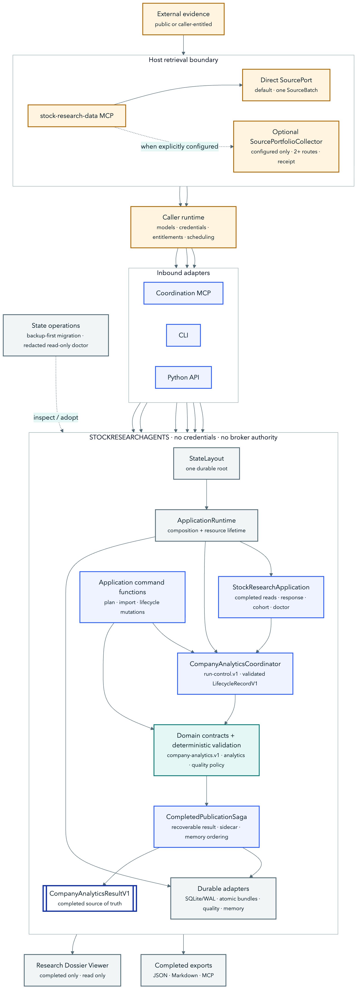
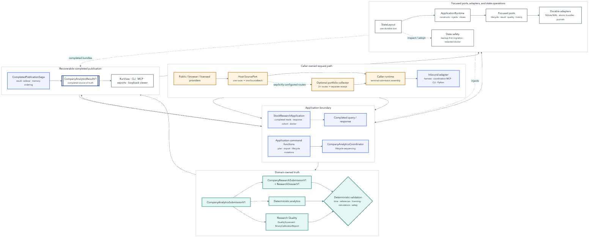
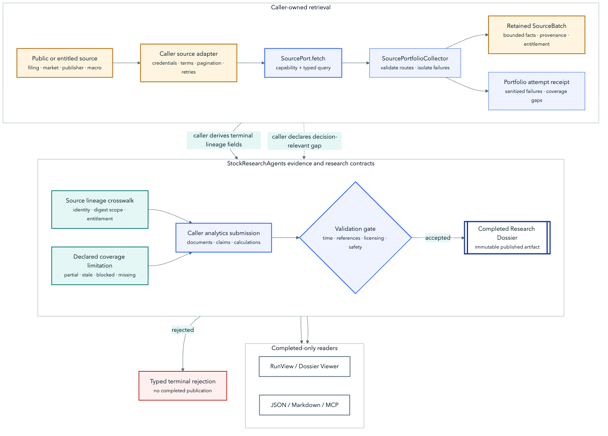
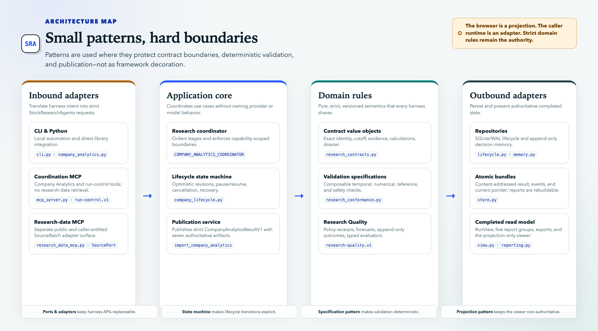
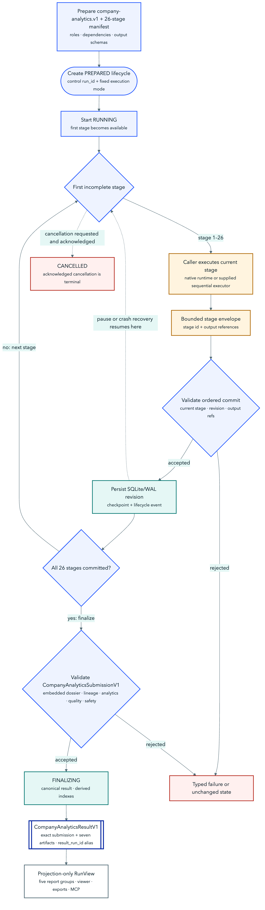
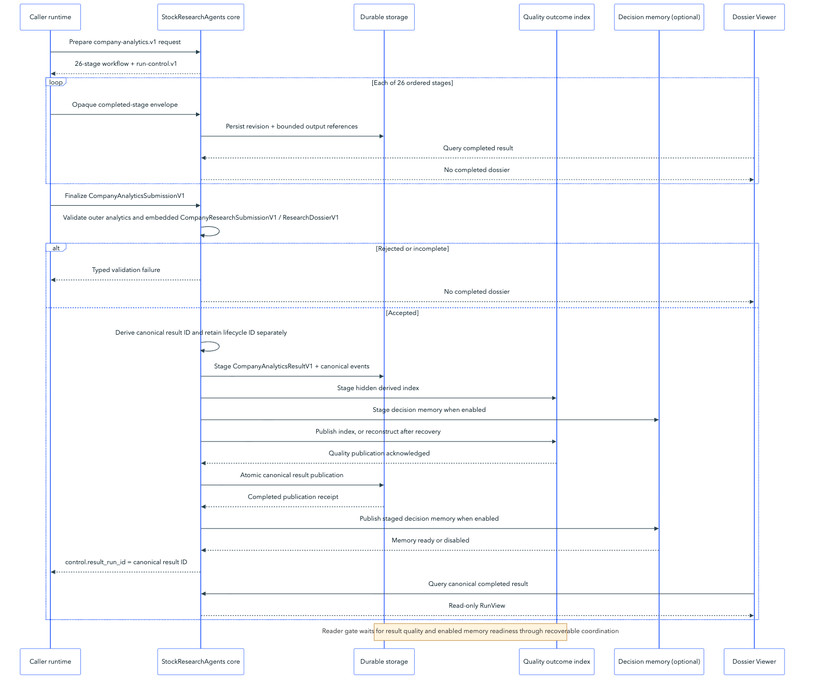

# StockResearchAgents architecture

- **Purpose:** define implementation boundaries, components, state transitions, persistence, and completed presentation.
- **Audience:** host integrators, maintainers, and reviewers.
- **Canonical for:** system structure and module ownership.
- **Not canonical for:** product language, wire-field definitions, version status, or proof.

## Architectural drivers

StockResearchAgents separates caller-owned research execution from core-owned contracts, validation, persistence, and final projection. Its one public product profile, `company-analytics.v1`, composes the embedded `company-research.v1` dossier foundation with deterministic analytics, research-lab records, forecasts, and evaluation without embedding a model client or provider.

The design is driven by five invariants:

1. Any capable harness can execute the same workflow semantics.
2. Credentials, provider clients, exact prompt wording, source terms, and intermediate criterion attestations remain caller-owned; core stage roles, objectives, and completion-criteria declarations remain versioned workflow semantics, while StockResearchAgents validates the terminal bundle and coordinator commitments.
3. Strict point-in-time contracts and deterministic validation are shared across harnesses.
4. Partial lifecycle state never becomes a completed research artifact.
5. No StockResearchAgents surface gains broker, order, approval, or execution authority.

## System at a glance

[](../assets/architecture/system-context.svg)

[](../assets/architecture/solid-ports-adapters.svg)

External evidence enters only through a caller runtime, optionally through the separate `stock-research-data` MCP. A normal capability tool calls one configured `SourcePort` and returns one `SourceBatch`; a separately configured, optional portfolio tool fans out across at least two routes and returns a `SourcePortfolioReceipt` without merging publisher batches or entitlements. The caller coordinates `company-analytics.v1` through the coordination MCP or another inbound adapter and sends typed submissions plus bounded stage descriptors across the trust boundary. StockResearchAgents validation and publication decide whether a Completed Research Dossier exists; the viewer and exports read completed results only.

Validation reports describe StockResearchAgents' deterministic checks against its own versioned contracts. Provider availability, caller execution, and investment usefulness remain separate claims and cannot be inferred from contract validation.

## Evidence-to-dossier flow

[](../assets/architecture/source-to-dossier.svg)

The caller may retrieve public or entitled data directly through one `SourcePort.fetch(capability, typed_query)` call, producing one bounded `SourceBatch`. Portfolio collection is additive, not mandatory: only an explicitly configured `SourcePortfolioCollector` validates at least two routes, isolates failures, preserves each provider batch and entitlement, and returns a terminal `SourcePortfolioReceipt`. Both types remain host-side rather than becoming core-domain contracts. In either route, the caller derives the typed terminal lineage fields carried by `CompanyAnalyticsSubmissionV1`; a portfolio receipt additionally retains sanitized failed attempts and coverage gaps, and the caller must carry decision-relevant gaps into the submission as explicit limitations. StockResearchAgents validates the crosswalk's identity, digest scope, and entitlement fields alongside the embedded `CompanyResearchSubmissionV1` and `ResearchDossierV1` provenance, then validates the resulting claims and deterministic calculations. A rejected terminal submission is not published. An accepted dossier may represent incomplete coverage only through an explicit limitation. Only an atomically published dossier reaches the viewer, MCP, or exports.

## Architectural patterns

[](../assets/architecture/portable-patterns.png)

[Open the full-resolution architecture pattern map.](../assets/architecture/portable-patterns.png)

| Pattern | Concrete use | Why it exists |
| --- | --- | --- |
| Ports and adapters | CLI, MCP, Python, Codex, caller submissions | Keeps harness and transport APIs replaceable |
| Composition root | `ApplicationRuntime` and `create_runtime(StateLayout)` in `bootstrap.py` | Builds and closes infrastructure without leaking construction into lifecycle or transport modules |
| Application services | `StockResearchApplication` for completed reads, responses, cohort evaluation, and diagnostics; dedicated plan/import/lifecycle command functions | Keeps shared use cases transport-neutral without claiming one facade owns every command yet |
| Publication saga | `CompletedPublicationSaga` behind `CompanyAnalyticsCoordinator` | Makes staged result, sidecar, memory, and final publication recovery explicit |
| Anti-corruption layer | Strict analytics submission and `SourceBatch` parsing | Prevents caller and provider semantics from leaking into the domain |
| Provider strategy/router | Capability-specific source providers behind `PublicResearchDataAdapter` | Adds or replaces providers without expanding one capability switch |
| State machine | Lifecycle statuses, optimistic revisions, pause/resume, cancellation, finalization | Makes legal transitions and recovery boundaries explicit |
| Specification pattern | Temporal, numerical, referential, completeness, entitlement, and safety checks | Keeps validation deterministic and composable |
| Repository pattern | SQLite/WAL lifecycle, decision memory, atomic result store | Separates durable storage from domain rules |
| Projection pattern | `RunView`, exports, Research Dossier Viewer | Prevents presentation from becoming an authority |
| Content-addressed value objects | Dossier/result digests and safe stage descriptors | Makes identity, idempotency, and integrity explicit |
| Contract composition | `CompanyAnalyticsSubmissionV1` around `CompanyResearchSubmissionV1` | Extends the dossier with typed analytics and quality sidecars without widening the foundation |

Patterns are used only where they protect a real boundary. The codebase deliberately avoids a dependency-injection framework, generic command bus, continuously running projector, or repository abstraction for every dataclass.

## Authority boundary

The caller runtime owns:

- exact model prompts, reasoning, native agent scheduling, and exact generated text;
- concrete filing, market, news, transcript, and other retrieval;
- provider credentials, tool authentication, entitlements, and source terms;
- exact-cutoff retrieval decisions and adaptive-history expansion; and
- hard interruption of in-flight work.

The StockResearchAgents core owns:

- versioned wire contracts and workflow manifests;
- recursive credential, raw-content, and execution-field rejection;
- temporal, referential, numerical, debate, portfolio, and completeness validation;
- bounded stage envelopes and safe execution receipts;
- SQLite/WAL lifecycle state, optimistic revisions, atomic result/event publication, and report export;
- publication-gated, exact-cutoff-safe decision memory; and
- completed-result `RunView`, MCP reads, and loopback browser projection.

No browser or core workflow component owns research logic.

## Version map

```text
company-analytics.v1  -> CompanyAnalyticsSubmissionV1
                           |
                           +-> CompanyResearchSubmissionV1
                           |      +-> ResearchDossierV1
                           +-> analytics + lineage + run card
                           +-> hypotheses + iterations
                           +-> quality receipt + forecasts

CompanyAnalyticsResultV1 -> exact CompanyAnalyticsSubmissionV1
                           +-> seven authoritative artifacts

run-control.v1        -> prepared -> running -> finalizing -> completed

internal ORCL executor -> deterministic test path only
```

`company-analytics.v1` is the one public product profile. Its terminal `CompanyAnalyticsSubmissionV1` embeds the `company-research.v1` foundation and adds typed analytics, run-card, hypothesis, iteration, quality, and forecast sidecars. `company-research.v1` remains an internal compositional foundation rather than a second product profile. The ORCL fixture is test-only and does not participate in public profile discovery.

[Active contract set](COMPATIBILITY.md) records the shipped versions and their roles.

## Embedded company-research foundation

Stages 1–15 of `company-analytics.v1` implement the `company-research.v1` foundation. They produce the `CompanyResearchSubmissionV1` embedded by the outer analytics submission:

| Ordinal | Stage | Main contract responsibility |
| ---: | --- | --- |
| 1 | `research.plan` | Objectives, coverage, latest-data checks, adaptive history, stop conditions. |
| 2 | `evidence.official` | Filings, investor relations, exact availability. |
| 3 | `evidence.market` | Market history and latest-session verification. |
| 4 | `analysis.financial` | Filing, guidance, and transcript analysis. |
| 5 | `analysis.company` | Company events, peers, and factors. |
| 6 | `audit.evidence` | Claim grounding, counterevidence, coverage, and temporal audit. |
| 7 | `verify.numerical` | Deterministic recalculation and unit/period reconciliation. |
| 8 | `debate.bull` | Grounded bullish argument. |
| 9 | `debate.bear` | Counterclaim, counterevidence, and rebuttal. |
| 10 | `synthesis.valuation` | Scenario valuation with calculation links. |
| 11 | `synthesis.risk` | Risk scenarios and sanitized portfolio context. |
| 12 | `research.delta` | Cutoff-safe memory and change-from-prior research. |
| 13 | `research.monitor` | Monitoring triggers and consequences. |
| 14 | `evaluate.final` | Evidence, numerical, temporal, and completeness evaluation. |
| 15 | `publish.dossier` | Completed-only atomic publication. |

Every stage declares only capability identifiers and JSON Schema output references. Concrete providers are absent from the manifest.

## Research terminal contract

`CompanyResearchSubmissionV1` contains the original request and one `ResearchDossierV1`. Both use schema version `company-research.v1`; the workflow ID is `stockresearchagents.company-research.v1`.

The request freezes:

- exact `requested_at` and `cutoff_at` timestamps;
- typed instrument identity and truthful `research_mode` (`live`, `fixture`, or `historical_replay`);
- research objectives, coverage dimensions, history windows, latest-data checks, and stop conditions;
- output language; and
- optional sanitized, explicitly non-executable portfolio context.

The completed result retains the request losslessly inside `CompanyAnalyticsResultV1.submission.company_research.request`; it is authoritative for `research_mode`, exact cutoff, plan, and optional sanitized context. The separate authoritative `research_dossier.v1` artifact contains first-class documents, calculations, metrics, claims, arguments, filings, filing changes, transcripts, guidance, peers, factors, valuations, entities, events, risks, monitoring, prior outcomes, evaluation, research delta, coverage, recommendation, summary, limitations, and optional context impact.

All IDs are local to the dossier and cross-references must resolve. Documents retain bounded extracts only when redistribution is permitted. The terminal artifact is size-bounded and cannot contain credential-shaped, raw-source, or execution material.

## Company-analytics execution

`prepare_company_analytics` returns a 26-stage manifest, a selected research pack, and the execution mode selected before work starts. `sequential` exposes coordinator/runner infrastructure with `executor_required` readiness and requires a caller-supplied `LifecycleStageExecutor`; it supplies neither model reasoning nor retrieval. `native` requires a caller runtime adapter, and `import` accepts one complete caller-produced bundle through the implemented coordination/import boundary while full live research remains adapter-dependent. Stages 1–15 build and audit the embedded research dossier. Stages 16–26 add falsifiable hypotheses; fundamentals; DCF, reverse-DCF, comparables, and sensitivities; consensus; positioning; catalyst mapping; point-in-time experiment plans/receipts; Research Quality; and atomic completed publication.

For a stateless plan, the caller may execute dependency-ready work with native subagents and parallel tools before importing one complete payload. A durable `native` run still commits one current first-incomplete stage at a time; parallel retrieval does not relax coordinator ordering. Every primary stage carries a versioned role, objective, completion criteria, semantic capabilities, dependencies, and output references. The sequential runner drives those same coordinator boundaries for a one-agent caller and resumes from the first incomplete stage. Contract semantics and terminal information remain the same; exact prompt wording, agent spawning, and scheduling do not.

The analytics-profile `CompanyAnalyticsCoordinator` provides the public 26-stage lifecycle through `analytics-init` / `create_company_analytics_run` and shared lifecycle controls. `ApplicationRuntime` is the composition root for a single immutable `StateLayout`; it constructs the SQLite/WAL lifecycle repository, result store, Research Quality store, memory repository factory, and coordinator. Its `StockResearchApplication` facade owns completed-result reads and responses, cohort evaluation, and diagnostics. CLI and MCP plan, import, and lifecycle mutations currently call dedicated application command functions or the injected coordinator directly; the diagrams show that separate path rather than treating the facade as broader than its implementation. Lifecycle code itself depends only on application ports and a workflow definition. It checkpoints bounded stage descriptors and optional safe receipts, accepts only the current first-incomplete stage, validates the terminal analytics payload, and binds the final run card to coordinator-owned envelope and commit-receipt digests for all 26 stages. The terminal commitment uses a normalized publication-candidate digest so the contract is not circular. It also rejects a terminal run card whose execution mode differs from the mode fixed at run creation. During finalization, `CompletedPublicationSaga` stages the canonical result and recoverable sidecars, advances the validated lifecycle record, publishes sidecars before the result becomes readable, then publishes decision memory. The atomically published source of truth is `CompanyAnalyticsResultV1`, containing the exact `CompanyAnalyticsSubmissionV1` and seven authoritative artifacts. The separate quality outcome index can be reconstructed from completed artifacts after a crash; the design does not claim a distributed transaction. Atomic complete import remains available when lifecycle state is unnecessary.

[](../assets/architecture/company-analytics-lifecycle.svg)

The caller runtime can perform dependency-ready retrieval or analysis in parallel, but a durable run commits exactly one current first-incomplete stage at a time. Each accepted commit creates a new SQLite/WAL revision; pause and crash recovery return to that ordered boundary, while acknowledged cancellation is terminal. A valid final analytics submission enters a recoverable `FINALIZING` phase that stages the canonical result and derived quality/memory indexes before publication. This gives a caller-supplied sequential executor and a native multi-agent runtime the same observable contract without claiming identical agent scheduling.

`prepare_company_analytics` returns a self-contained bundled analytics schema containing typed analytics and inward source-lineage definitions. `source-lineage-crosswalk.v1` preserves provider-neutral host batch/observation identities without moving credentials or raw content into core state. It declares whether each digest covers authoritative source content, an exact bounded UTF-8 extract, or a normalized source record, then joins that identity to the dossier document, analytics source/license receipt, and run-card batch set. JSON Schema validates shape and local URI/digest constraints; strict Python contracts remain authoritative for complete referential and entitlement equality and for cross-field rules such as the global requirement that every `forecast_id` start with `<quality_run_id>.`.

## Temporal model

The request cutoff is an exact instant, not only a market date. The dossier `as_of_at` must match it exactly.

Source documents separate:

- when an event or source was published;
- when it became available to the research process;
- when the caller retrieved it; and
- the cutoff used for the run.

Completed-contract validation rejects documents, filings, metric information vintages, transcript events, factor observations, historical events, and prior outcomes that were unavailable at the cutoff. A metric's `period_end` is its economic period, while `metric.as_of_at` is the cutoff-safe information vintage for the value. Reported metrics cannot describe a period later than their vintage; estimates, assumptions, and deterministic calculations may describe future periods when every input and supporting document was available by their declared vintage. Later processing and completion timestamps are allowed because validation distinguishes evidence availability, economic period, and processing time.

Decision memory applies the same model. Historical recall filters decisions before result limits, filters outcomes independently by observation time, and excludes embedded evidence availability later than the cutoff. Unparseable historical availability metadata fails closed.

## Calculation and claim integrity

Claims link directly to source documents and metrics. Counterclaims and counterevidence remain separate. Debate turns link to claims and assumptions, name concessions and unresolved issues, and may rebut only an earlier turn in the same debate.

Calculated metrics and valuations use deterministic calculation receipts: engine, operation, formula, input metric IDs, constants, result, unit, tolerance, and rounding. Semantic validation safely recomputes bounded arithmetic, requires every declared input and constant to appear in the formula, verifies the formula shape against the declared operation, applies decimal rounding followed by the declared absolute tolerance, and checks valuation and sensitivity outputs against referenced calculation results. Model prose cannot substitute for a calculation receipt.

## Completeness and entitlements

Completeness means declared decision-relevant coverage, not omniscience. Every planned coverage dimension must appear in the dossier. `complete` requires retained sources; `partial`, `missing`, `stale`, `conflicting`, `entitlement_blocked`, and `not_applicable` require an explicit limitation.

The caller owns entitlement checks. A coverage dimension uses `entitlement_policy: caller_entitled_allowed` only when the caller may lawfully use entitled sources; otherwise it uses `public_only`. Licensed sources may be referenced only under the caller's rights. A non-redistributable source is metadata/reference only and cannot carry an extract, including a bounded one. Seeking Alpha content, transcripts, scores, ratings, and proprietary methodology are not bundled or treated as StockResearchAgents-owned data; its product patterns may inform UX, but content access remains a caller licensing concern. The normalized `SourcePort` exposes one `fetch(capability, typed_query)` operation. Test-fixture, replay, and router adapters implement it, and query validation rejects credentials embedded in signed URLs as well as explicit credential fields.

## Lifecycle and publication

[](../assets/architecture/completed-publication.svg)

The viewer receives no partial-stage path. A terminal submission is validated, staged, and atomically committed before the completed read model becomes visible.

The public `run-control.v1` tools operate the 26-stage Company Analytics lifecycle. `CompanyAnalyticsCoordinator` applies the durable concepts across the embedded research foundation and analytics stages:

- private SQLite/WAL records and strict nonterminal opaque-reference envelopes;
- optimistic revisions and first-incomplete-stage resume;
- capability-scoped safe receipts with optional input/output digests;
- pause, cooperative cancel request, and caller acknowledgement;
- cursor-readable lifecycle events;
- strict validation of the terminal `publish.completed` envelope;
- recoverable staging of result/events and derived indexes without claiming a distributed transaction; and
- completed-only publication.

Every stored aggregate is decoded as `LifecycleRecordV1` on create, read, and update. The typed aggregate validates identity, timestamps, topology, status-dependent fields, and events, while the repository cross-checks the durable revision so malformed or stale state cannot bypass optimistic concurrency.

Inbound adapters create the same Company Analytics run: the CLI exposes `analytics-init`, while MCP and native hosts use `create_company_analytics_run` or the corresponding Python coordinator. Shared command functions and `run-control.v1` coordinator operations cover start, receipts, commits, pause/resume, status, events, cancellation, and finalization. `StockResearchApplication` centralizes completed reads, response assembly, cohort evaluation, and diagnostics; adapters do not duplicate those policies.

Persistence flags describe observed execution, not requested intent. Stateless `analytics-import` has no lifecycle checkpoint or memory publication, so both flags are false. Durable analytics finalization sets checkpointing true. The public coordinator supplies a durable memory store by default. Custom coordinators either provide a store/factory, disable memory explicitly, or fail when memory is requested; they never silently downgrade the capability.

## State operations

`StateLayout` resolves one caller-selected state root and derives every durable location, including the Research Quality directory and decision-memory database. `create_runtime(StateLayout)` is the explicit composition path for isolated applications and owns resource shutdown.

The enforced local process model permits concurrent readers and multiple cooperating writer processes. Lifecycle, result,
event, staging, and Research Quality mutations share one reentrant, OS-backed advisory writer lock under the state root;
the quality directory resolves that lock through its parent root. Each file-backed store refreshes its durable snapshot only
after acquiring the lock, preventing a long-lived process from publishing a cached result/event view or losing an outcome
append. Lifecycle updates retain their SQLite `BEGIN IMMEDIATE` transaction and optimistic revision predicate inside the
same writer boundary. Reads remain outside the writer lock and rely on SQLite/WAL or atomic replacement; current-run and
event projections recheck durable state so long-lived readers observe later publications. Research Quality visibility is
the deliberate exception: `is_published` and quality projection reads take the shared writer lock before their instance
lock, so they cannot enter between a staged registration rename and staged-file removal. The persistent lock marker is not
a lease record and carries no owner data; operating-system descriptor cleanup releases ownership after normal exit,
exceptions, or process termination.

State adoption is intentionally conservative. The migration planner performs a no-write JSON and SQLite integrity pass, rejects symbolic links, and reports whether existing unversioned artifacts require adoption. Applying that plan requires a complete backup outside the state root before the version manifest is written atomically; it does not rewrite existing artifacts. The `doctor` use case is a separate redacted, read-only inspection path. It reports only bounded health and count fields for root permissions, artifact integrity, schema status, pending staged publications, and the viewer registry—never run identifiers, source content, paths, credentials, or token values.

## Completed-result projection

The Company Analytics publication service converts a validated `CompanyAnalyticsSubmissionV1` into strict `CompanyAnalyticsResultV1`. The result retains the exact submission and seven authoritative artifacts: `research_dossier.v1`, `analytics_bundle.v1`, `run_card.v1`, `hypothesis_ledger.v1`, `research_iterations.v1`, `research_quality.v1`, and `forecast_set.v1`. Its canonical `run_id` is content-derived from the submission, research pack, and workflow digest, so repeated stateless imports are idempotent and different submissions remain distinct.

A durable lifecycle begins earlier with a separate randomly generated control `run_id`. That identifier addresses checkpoints and mutations only. After atomic completion, `RunControlV1.result_run_id` points to the canonical `CompanyAnalyticsResultV1.run_id`; readers, report descriptors, events, exports, and viewer URLs use the canonical result ID rather than rebinding it to the lifecycle ID.

`build_report_artifacts` derives five ordered report groups—Executive Summary, Evidence and Claims, Analytics and Valuation, Risks and Counterevidence, and Monitoring and Quality—plus provenance, Markdown, and structured descriptors. `build_run_view` then projects the completed result and those derived reports without interpreting their contents. The browser renders only when the canonical result is completed. It never becomes a second research or publication authority, and partial lifecycle state never becomes a dossier.

Presentation is an adapter invoked only after that atomic publication succeeds. It returns a runtime-local
`presentation-link.v1` receipt and ensures one reusable loopback viewer daemon per durable state directory. The same
static application renders every company by loading the typed run selected through `?run=<run_id>`; no per-company
HTML generation exists. The daemon rereads atomic durable bundles on each request so later publications become visible
without restarting it, and it reopens the append-only quality projection so later outcome observations are visible.
A private cross-process lifetime lease preserves the one-daemon invariant. A capability-token bootstrap, exact
loopback Host/Origin checks, browser security headers, and protocol/package/schema/asset identity checks protect the
detached boundary. A path-only adapter supports headless harnesses, and viewer failure never changes the completed
research result.

## Research Quality boundary

Research Quality is an implemented analytics sidecar capability. It owns policy/run provenance, forecasts issued at publication, typed later outcome observations, decision-support status, and deterministic evaluation. `QualityScorecard` evaluates one forecast against its active resolved observation. `BinaryCalibrationReport` is a separate evaluation-only report over a caller-approved, fixed historical binary cohort: it enforces one horizon and resolution rule, an evaluation cutoff, distinct instruments, and a minimum sample size before reporting Brier score, log loss, calibration bins, and expected calibration error. It neither fits nor deploys a model and does not mutate the completed result.

It does not own retrieval, provider health workers, prompts, execution, portfolio mutation, or browser-side scoring. The embedded research dossier remains unchanged; the outer analytics submission carries the sidecars described in [Research Quality](RESEARCH_QUALITY.md) and the [active contract set](COMPATIBILITY.md).

## Code location map

| Concern | Canonical location |
| --- | --- |
| Core run contracts | `src/stock_research_agents/contracts.py` |
| Company-research contracts | `src/stock_research_agents/research_contracts.py` |
| Company-research validation | `src/stock_research_agents/research_conformance.py` |
| Workflow manifests and schemas | `src/stock_research_agents/workflow/` |
| Embedded research foundation | `src/stock_research_agents/research_contracts.py`, `research_conformance.py`, `workflow/company-research.v1.json` |
| `run-control.v1` lifecycle | `src/stock_research_agents/company_lifecycle.py` |
| Application services and composition | `src/stock_research_agents/application.py`, `bootstrap.py`, `application_ports.py` |
| State layout, migration, and diagnostics | `state.py`, `state_migrations.py`, `diagnostics.py` |
| Company analytics profile | `src/stock_research_agents/company_analytics_v1/`, `company_analytics.py` |
| Deterministic analytics | `src/stock_research_agents/analytics_v1/` |
| Research lab and packs | `src/stock_research_agents/research_lab_v1/` |
| Research Quality | `src/stock_research_agents/research_quality_v1/` |
| Host source ports/adapters | `src/stock_research_agents_host/`, including `adapters/providers/` and `source_router.py` |
| Generic lifecycle/store/memory | `lifecycle.py`, `store.py`, `memory.py` |
| Completed projection | `view.py`, `report_server.py`, packaged `web/` |
| Automatic presentation | `presentation.py`, `viewer_daemon.py` |
| Inbound CLI/MCP adapters | `cli.py`, `mcp_server.py` |

## Target runtime direction

The product runtime is the harness-neutral StockResearchAgents core. Codex, generic multi-agent runtimes, a caller-supplied `sequential` executor, and `import`-mode MCP consumers translate their mechanisms into the same `company-analytics.v1` stages, terminal `CompanyAnalyticsSubmissionV1`, and completed `CompanyAnalyticsResultV1`. Lifecycle, memory, export, and completed-only presentation remain common.

Concrete research-data MCP implementations are a host-adapter concern. The isolated server launched by `stock-research-data-mcp` registers seven public metadata/fact tools: SEC filings, fundamentals, and statements; GDELT company and global news metadata plus publisher links; World Bank macro observations; and read-only Polymarket current-market context. It remains separate from the coordination MCP, which owns Company Analytics and `run-control.v1`. The prediction-market projection is neither forecast truth nor an executable trading action. Licensed price/indicator adapters, host-OAuth Reddit, and approved StockTwits access are still absent from the default server. Provider SDKs, credentials, sessions, and entitlement enforcement stay outside the core domain; current registration is not proof of live availability or complete company coverage. The adapter contract and proof requirements are defined in [Research-data MCP adapters](RESEARCH_DATA_MCP.md).

## Security and safety invariants

- No StockResearchAgents input or output carries API keys, tokens, authorization headers, or provider configuration secrets.
- No raw copyrighted filing or transcript body belongs in the bounded dossier.
- No broker/order execution field or UI action is allowed.
- Portfolio context is optional, sanitized, and explicitly non-executable.
- The Research Dossier Viewer binds only to loopback and exposes read-only completed results.
- Missing sources and licensed-data gaps remain visible; no silent fallback is allowed.
