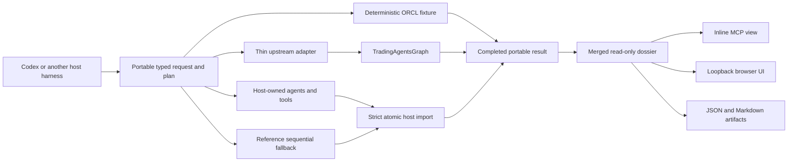

# TradingAgents Portable architecture

## Purpose

This repository is an incubation environment for consuming upstream TradingAgents research through a portable CLI/MCP boundary and presenting the completed output as a read-only dossier.

The portable layer owns workflow contracts, validation, and projection, not model inference. The active host harness can execute the complete workflow with its own internal agents; optional legacy execution remains owned by upstream `TradingAgentsGraph`.

## Boundary

TradingAgents Portable owns:

- versioned run, workflow, event, evidence, decision, artifact, and dashboard contracts;
- the deterministic ORCL demonstration fixture;
- harness-neutral MCP tools and a Codex plugin/skill bundle;
- a stateless host plan plus atomic completed-run import boundary that accepts no model credentials;
- a versioned JSON Schema, per-stage context/tool/output contracts, capability negotiation, and a reference sequential executor;
- the post-run dossier projection, inline MCP view, loopback browser UI, and JSON/Markdown artifacts;
- conformance tests and the feature-parity ledger.

The main TradingAgents repository remains the source of truth for:

- production prompts and agent behavior;
- provider clients and credential precedence;
- data-vendor implementations;
- LangGraph execution, legacy checkpoints, reports, and decision memory.

The portable manifest records the upstream workflow's observable role, tool-capability, routing, context, and final-information semantics. The thin upstream adapter still imports and calls the original implementation; no provider client, model loop, or LangGraph node implementation is forked.

The installable `upstream` extra pins the official base commit used for conformance. A compatible checkout supplied through `TRADINGAGENTS_LEGACY_PATH` takes precedence, so an alternate branch such as PR #1195 can add a provider without changing the portable contracts. The Codex plugin does not register or import this path. Credentials and Codex OAuth state remain owned by an explicitly launched standalone compatibility process and are never serialized into portable contracts.

## Runtime shape

No UI projection owns workflow logic. The dossier exists only after execution completes; it is not a setup, orchestration, live-progress, cancellation, or resume surface.

## Workflow contract

For effective analysts `A`, research depth `N`, and risk depth `R`, a complete run contains:

1. each effective analyst in canonical order;
2. exactly `2 × N` alternating bull/bear research turns;
3. Research Manager;
4. Trader analytical proposal;
5. exactly `3 × R` aggressive/conservative/neutral risk turns;
6. terminal Portfolio Manager decision.

For host-native execution, the portable layer expands these semantics into exact stage descriptors with context projections, allowed tool-capability IDs, instructions, output schema references, and requested output language. Codex or another harness owns agent spawning, reasoning, and concrete tool binding. A reference sequential executor proves the contract without Codex or LangGraph. A strict importer validates completeness, provenance dates/cutoff, evidence references, non-executability, and credential-shaped fields before atomic publication. For optional legacy execution, provider behavior, data access, workflow decisions, and checkpoint mechanics remain upstream responsibilities.

## Execution modes

- **Fixture:** deterministic, credential-free, network-free ORCL run used for local proof and conformance.
- **Host-native:** preferred credential-free path. The current harness executes the exact topology with its own agents/tools and submits one complete result. The portable server does not invoke a model, persist partial state, or accept provider configuration.
- **Upstream delegation:** accepts arbitrary Yahoo-style company/instrument symbols through the standalone CLI or explicit opt-in legacy MCP, calls upstream `TradingAgentsGraph`, and maps completed state into portable contracts. This mode is absent from the Codex plugin.

Host-native tests prove plan expansion, plan/request round trip, provenance cutoff validation, credential rejection, generic sequential execution for multiple symbols, canonical projection, idempotent atomic publication, and CLI/MCP portability. They do not prove token-level live streaming or a universal checkpoint implementation; those remain negotiated host/adapter capabilities. Fixture and fake-graph tests separately prove the delegated adapter seam. Live legacy provider credentials and data-vendor access remain unverified.

## Dashboard model

The dashboard is a completed-run dossier centered on a decision-provenance ribbon:

`evidence → analysts → research debate → manager → trader → risk debate → portfolio`

It exposes available completed-run data:

- run identity, request settings, capability/runtime provenance, and final status;
- every analyst report and every available debate turn, with aggregate role-history fallback for completed upstream state;
- Research Manager, Trader, all three risk roles, and Portfolio Manager outputs;
- structured evidence/provenance when the executor supplies it, plus the complete upstream report text otherwise;
- available source dates, providers, degradation, and diagnostics without inventing missing metadata;
- legacy reports/logs plus structured JSON, projected events, and Markdown artifacts.

It does not expose controls for configuration, launch, orchestration, live progress, cancellation, checkpoint cleanup, or resume. The HTTP API is read-only and includes the merged dossier at `GET /api/runs/{run_id}/view` and `GET /api/runs/current/view`.

Trade-like fields are always labeled `non_executable_analytical_scenario`; no projection may expose an order action.

## Incubation exit criteria

Any proposal back to the main project must distinguish verified portable behavior from runtime-unverified upstream behavior. At minimum:

- the deterministic ORCL flow completes every required stage and report section;
- the plugin and skill manifests validate;
- the exact MCP stdio command starts cleanly and tools are discoverable;
- the default MCP exposes only the 12 credential-free tools and imports no legacy/upstream module;
- every expanded stage resolves to a versioned context/tool/output contract and the generic sequential conformance runner completes multiple company symbols;
- the loopback server binds only to loopback and serves the same run/result/events/view projections;
- backend, UI-contract, security, and integration tests pass without network or secrets;
- the adapter delegates arbitrary supported symbols to `TradingAgentsGraph`, maps completed state, and fails with typed setup guidance when unavailable;
- live provider execution and checkpoint resume remain explicitly unverified until credentialed evidence exists;
- host-native plan/import is verified; its events are post-run import receipts, not fabricated execution telemetry;
- live upstream event streaming remains explicitly unimplemented;
- there is no broker/order execution surface;
- an independent review confirms that no business logic was duplicated from the sibling repository.

## Main-repository migration

If migration is approved, move contracts and tests first, then the thin adapter, then the post-run dossier. Preserve the main repository's CLI and public Python API. Do not replace or fork `TradingAgentsGraph`; it remains the execution authority.
