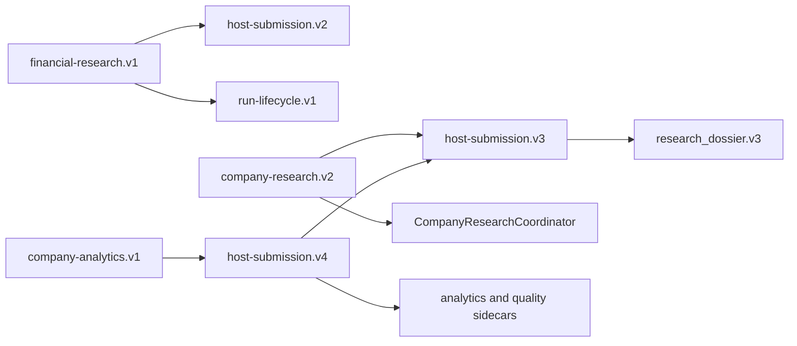

# Compatibility

- **Purpose:** define the version map, frozen surfaces, additive aliases, and migration rules.
- **Audience:** integrators and maintainers.
- **Canonical for:** profile compatibility and version evolution.
- **Not canonical for:** feature proof; see `VALIDATION.md`.

## Current map



| Profile or artifact | Status | Human-facing name |
| --- | --- | --- |
| `financial-research.v1` | Preserved reader and currently available executor | TradingAgents Compatibility Workflow |
| `host-submission.v2` | Frozen | Compatibility terminal format |
| `run-lifecycle.v1` | Preserved | Compatibility lifecycle protocol |
| `company-research.v2` | Implemented | Evidence-First Company Research |
| `host-submission.v3` | Frozen | Completed Dossier terminal format |
| `research_dossier.v3` | Frozen | Completed Research Dossier |
| `company-analytics.v1` | Implemented, primary | Company Analytics |
| `host-submission.v4` | Implemented wrapper | Completed dossier plus analytics and quality sidecars |

## Rules

1. Frozen strict models never gain fields, including optional fields.
2. New semantics use parallel workflow profiles, schemas, and artifact kinds.
3. Existing readers continue to consume artifacts they understand and ignore only unknown outer artifact kinds.
4. Recognized artifact contents remain strict.
5. Discovery advertises available profiles and compatibility explicitly.
6. A preferred human-facing alias never removes a compatibility command in the same minor release.
7. `report` is the preferred CLI name; `dashboard` remains a compatibility alias.
8. `host-submission.v4` embeds the unchanged v3 submission and adds sidecars; it does not reinterpret frozen v3 fields.
9. Removing an executor never authorizes removal of its frozen schemas, historical readers, or saved-result migrations.
10. A user-facing executor may be removed only in a later major version after every transition gate passes and one published deprecation release has shipped.

## StockResearchAgents brand migration

`StockResearchAgents` is the preferred public repository, UI, documentation, and CLI brand. The rename is deliberately layered because install names, Python imports, state paths, schema IDs, workflow digests, and saved artifacts have different compatibility lifecycles.

| Surface | Preferred | Retained compatibility identity |
| --- | --- | --- |
| Repository and UI | `StockResearchAgents` | Historical release prose may name TradingAgents Portable |
| CLI | `stock-research-agents`, `stock-research-agents-mcp`, `stock-research-data-mcp` | All `tradingagents-portable*` and `tradingagents-research-data-mcp` scripts |
| Optional upstream MCP | No new branded alias while the transition inventory is frozen | `tradingagents-portable-legacy-mcp` |
| Codex display | `StockResearchAgents` | Plugin and skill machine identity `tradingagents-portable` during the compatibility release |
| Python | Documented as the StockResearchAgents portable API | `tradingagents_portable` and `tradingagents_host` imports |
| State and environment | `STOCKRESEARCHAGENTS_*` variables | Existing `TRADINGAGENTS_PORTABLE_*` variables and `tradingagents-portable` state directories |
| Wire and storage | No cosmetic rename | Existing schema IDs, workflow IDs, artifact kinds, media types, digests, bundle markers, and migration receipts |

The retained technical names are not duplicate business logic. They are aliases and frozen readers around one portable implementation. A future removal requires its own versioned migration and cannot be inferred from the repository rename.

## Legacy executor lifecycle

The optional upstream executor is currently **available and not deprecated**. Its removal is blocked by concrete research-data MCP coverage, semantic upstream dual-run conformance, a representative live/failure matrix, full surface equivalence, general saved-result migration, and the deprecation-release requirement.

When those gates eventually pass, the runtime adapter, `research` delegation, legacy MCP executable, and normal upstream dependency may leave the user surface. Frozen v1/v2 readers, historical artifacts, and deterministic migrations remain. [Legacy executor transition](LEGACY_TRANSITION.md) is canonical for this decision.

## Research Quality evolution

The analytics profile wraps—rather than mutates—the existing dossier:

```text
host-submission.v4
├── unchanged research_request.v3 semantics
├── unchanged research_dossier.v3
└── new research_quality.v1 sidecar
```

The implemented Python, CLI, MCP, profile-driven 26-stage lifecycle, completed-view, schema, digest, cutoff, crash-recovery, and conformance paths consume this wrapper.

Legacy `PriorOutcome.calibration_score` values cannot be backfilled into the new score model. They remain `legacy_unscored` until a typed forecast and outcome establish reproducible semantics.
