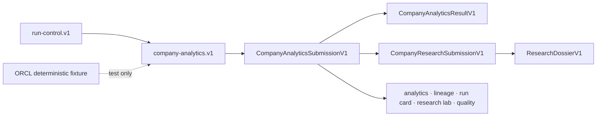

# Active contract set

- **Purpose:** record the shipped contract graph and additive evolution rules.
- **Audience:** integrators and maintainers.
- **Canonical for:** the public profile, embedded foundation, and terminal artifact composition.
- **Not canonical for:** feature proof; see [Validation](VALIDATION.md).

## Current graph



| Contract | Role |
| --- | --- |
| `company-analytics.v1` | The one public product profile and 26-stage workflow |
| `CompanyAnalyticsSubmissionV1` | Outer terminal submission validated and published by the product |
| `CompanyAnalyticsResultV1` | Canonical completed publication containing the exact submission and seven authoritative artifacts |
| `company-research.v1` | Embedded 15-stage evidence-first foundation |
| `CompanyResearchSubmissionV1` | Embedded request-plus-dossier submission |
| `ResearchDossierV1` | Completed research artifact inside the outer submission |
| `run-control.v1` | Durable lifecycle operations for the 26-stage product profile |
| Internal deterministic ORCL executor | Test-only end-to-end path; not a public profile or versioned contract |

## Evolution rules

1. Strict models never gain fields in place, including optional fields.
2. New semantics use a new schema or artifact version.
3. `CompanyAnalyticsSubmissionV1` composes the research foundation; `CompanyAnalyticsResultV1` retains that exact parsed submission without reinterpretation.
4. Recognized artifact contents remain strict and reject unknown fields.
5. Discovery advertises `company-analytics.v1` as the public product profile.
6. The ORCL fixture stays visibly synthetic and test-only.
7. Completed readers consume atomically published results; partial lifecycle state has no reader path.

## Research Quality composition

```text
CompanyAnalyticsSubmissionV1
├── CompanyResearchSubmissionV1
│   └── ResearchDossierV1
├── analytics and source-lineage sidecars
├── run card, hypotheses, and iterations
└── Research Quality Receipt and forecasts
```

Python, CLI, the coordination MCP, `run-control.v1`, completed views, schemas, digests, cutoff checks, and crash recovery all validate this same outer submission.
