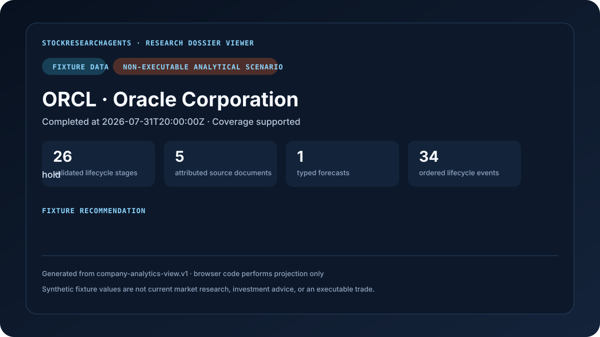

# Getting started

- **Purpose:** verify the StockResearchAgents contract and completed-publication boundary locally in under five minutes.
- **Audience:** first-time users and contributors.
- **Canonical for:** the first local success path.
- **Not canonical for:** live-provider behavior or host-adapter implementation.

This page exercises a public workflow plan and the deterministic, credential-free ORCL backend smoke check. The ORCL submission is test-only verification, not a public product profile or a research runtime. For live or historical research, use the public `company-analytics.v1` profile through [Codex](INTEGRATION.md#codex-plugin), [MCP](INTEGRATION.md#mcp), [Python](INTEGRATION.md#python), or a [custom harness adapter](INTEGRATION.md#generic-host-adapter-checklist).

## Prerequisites

- Python 3.11 through 3.14.
- [`uv`](https://docs.astral.sh/uv/).
- No API key or provider credential is needed for the deterministic fixture.

## Verify the completed-result path

```bash
uv sync
uv run python scripts/smoke_backend.py
```

The command must print an `ok` line with a content-derived run ID, `stages=26`, and a positive event count. It uses the same deterministic backend smoke check as CI and asserts a completed `company-analytics-result.v1`, the exact canonical stage order, a non-executable result, and a completed terminal event. The in-memory fixture proves contract and publication behavior, not current research quality, and intentionally does not create durable local state.

## Inspect the generated fixture demonstration



The committed ORCL result, events, completed view, preview, and digest manifest are generated from the deterministic contracts and checked byte-for-byte in CI. Regenerate them with:

```bash
uv run python scripts/generate_fixture_demo.py
```

Every artifact is visibly fixture-labeled and non-executable. This demonstrates the completed product projection; it is not current ORCL research, live-provider proof, investment advice, or a performance claim.

## Open the Research Dossier Viewer

```bash
uv run stock-research-agents report
```

Run this only after a host or `analytics-import`/durable-lifecycle flow has published a completed result into the configured state directory. The smoke check above is deliberately in-memory and does not seed the viewer. The foreground command is useful for diagnostics or an explicitly selected port. Normal completion adapters, including CLI and MCP, ensure the shared viewer automatically and return the URL without blocking. The preferred human-facing name is **Research Dossier Viewer**.

The viewer:

- binds only to an explicit loopback address;
- reads a completed canonical projection;
- performs no retrieval, reasoning, calculation, lifecycle mutation, or order action; and
- remains empty when no completed dossier is available.

## Inspect a caller plan through the CLI adapter

```bash
uv run stock-research-agents analytics-plan \
  --input examples/company-request.v1.json \
  --output plan.json
```

The output tells a caller which 26 stages to execute, which capability IDs each stage may use, which research pack applies, and includes a self-contained bundled analytics schema with typed analytics records. It does not run models or retrieve company data. Strict Python validation remains authoritative for cross-field rules such as the `<quality_run_id>.` forecast namespace.

The example request declares fixture mode. Editing its symbol alone does not make it live; the host must actually retrieve cutoff-valid live evidence and preserve the associated provenance, access, and coverage state.

## Inspect MCP discovery

```bash
uv run stock-research-agents-mcp
```

An MCP client should call `discover_capability` before assuming a tool, workflow, or runtime capability exists.

## Expected safety signals

- Research mode is visibly `fixture`, `live`, or `historical_replay`.
- Investment-style output says `non_executable`.
- Missing or licensed evidence remains visible.
- No StockResearchAgents payload contains credentials or provider configuration.
- The viewer cannot see partial stage output.

## Troubleshooting

**The viewer shows an old run.** Open the exact `presentation.url` returned by the completed operation. The bare
viewer URL intentionally resolves the durable `current` alias. See [Operations](OPERATIONS.md#state-directory).

**`analytics-plan` rejects the example.** Run `uv sync`, verify Python 3.11–3.14, and run the targeted tests in [Validation](VALIDATION.md).

**The plugin can plan but not retrieve live data.** That is the product boundary. The active Codex task or other caller runtime must retrieve and reason over evidence, then submit the typed result.
