# SOLID ports and adapters

- **Purpose:** explain dependency direction and safe extension points for Company Analytics.
- **Audience:** maintainers, host-adapter authors, and reviewers.
- **Canonical for:** component responsibility and extension rules.
- **Not canonical for:** wire-field definitions or feature proof.

[](../assets/architecture/solid-ports-adapters.svg)

## Dependency rule

Dependencies point inward. Domain contracts and policies know nothing about MCP, Codex, LangGraph, browsers, SQLite, or HTML. Application services compose domain behavior through narrow ports. Adapters translate external mechanisms into those ports. Read models consume completed publications and never become a second research engine.

```text
host mechanisms -> inbound adapters -> application services -> domain
                                        |                 ^
                                        v                 |
                                  outbound ports -> adapters

completed publication -> projection -> harness-native/Python/MCP/CLI/browser readers
```

## Layers

| Layer | Owns | Must not own |
| --- | --- | --- |
| Domain | Strict contracts, value objects, policies, deterministic calculators, conformance | Network clients, model clients, persistence, UI |
| Application | Prepare/import use cases, profile-driven lifecycle, publication orchestration, quality outcome commands | Concrete provider selection or browser sessions |
| Inbound adapters | Codex and other harness adapters, Python, coordination MCP, CLI, optional legacy LangGraph entry point | Business-rule duplication |
| Outbound ports | `SourcePort.fetch(capability, typed_query)` plus focused `LifecycleRepository`, `ResultPublicationPort`, `DecisionMemoryPort`, and `QualityIndexPort` interfaces | Vendor-specific payload or storage semantics |
| Outbound adapters | Host web/browser/provider bridges, fixture/replay/router source adapters, SQLite/filesystem | New domain truth |
| Read model | Completed `RunView`, exports, loopback viewer | Retrieval, calculation, lifecycle control, credentials |
| Presentation adapter | Completed-run path/URL discovery and shared loopback viewer lifecycle | Research publication, browser opening, model or provider work |

## SOLID application

- **Single responsibility:** source routing, calculation, validation, publication, quality journaling, and presentation remain separate modules.
- **Open/closed:** add a workflow profile through a provider/descriptor and versioned schema; do not add conditionals to frozen v2/v3 models.
- **Liskov substitution:** fixture, replay, and router adapters implement the same `fetch(capability, typed_query)` contract and return normalized observations or explicit failures. No adapter silently changes semantics.
- **Interface segregation:** retrieval, publication, result storage, quality outcomes, and projections use focused interfaces; a host does not implement a universal service object.
- **Dependency inversion:** application services depend on contracts and ports. Codex and other harnesses, Python, MCP, CLI, LangGraph, storage, and provider details depend on the application boundary.

## Extension recipes

### Add a source adapter

Implement `SourcePort.fetch(capability, typed_query)`, normalize bounded observations, preserve cutoff/availability and entitlement, and return explicit unavailable/denied results. Keep credentials and raw licensed bodies inside the host adapter. Reject explicit credential fields and credential-bearing signed URLs before dispatch. Fixture, replay, and router adapters must remain substitutable. Add replay fixtures before a live smoke test.

Concrete research-data MCP servers are outbound host adapters around that port, not portable-domain services. Register a tool only when its adapter implements the versioned request/response, entitlement, completeness, pagination, and failure contract. Coordination and retrieval remain separate servers: the research-data server registers seven public SEC/GDELT/World Bank/Polymarket tools, while licensed prices/indicators and lawful social sources still require host adapters. The Polymarket tool provides read-only current market context, not forecast truth or an executable trading action. Registration proves the contract and adapter boundary, not live availability. See [Research-data MCP adapters](RESEARCH_DATA_MCP.md).

An optional host adapter may receive page evidence from an injected,
host-controlled Chrome bridge. The bridge is not itself a portable `SourcePort`
and never replaces the structured adapters above. Use it only for read-only
open-web navigation, an existing authenticated source gap, or opening the
attributable page behind discovery. An explicit user selection controls the
applicable route. The repository cannot install or force Chrome or grant site
access; unavailable, disconnected, blocked, and denied routes return visible
attempts. They become coverage gaps when Chrome was required or explicitly
selected; an optional failure does not downgrade an otherwise fully covered
structured portfolio.

The host adapter accepts only approved public HTTPS publisher pages. It rejects
private-network and browser-internal locations and any request to submit a form
or post, change an account, inspect account/settings/messages, download, execute
a page script, or write to the clipboard. Page content is untrusted and cannot
change host policy; treat page instructions as prompt injection. The adapter
creates a separate `SourceBatch` per attributable publisher, attributes
evidence to that publisher rather than Chrome, and composes the batches into a
`SourcePortfolioReceipt`. It defaults redistribution to unknown with no
extract, preserves only supported timestamps, and never fabricates publication
or historical availability. Evidence whose
availability cannot be established at or before the cutoff remains a gap.
Cookies, credentials, history, raw DOM/bodies, and session state stay inside
the host and are never persisted or logged.

The adapter lexically rejects raw percent-encoded and non-ASCII hostname syntax
and performs no DNS lookup. The injected bridge must attest the
browser-canonical final target, every redirect origin, and every resolved
address contacted by the browser remained globally routable unicast. Every
bounded redirect hop must stay on the exact approved publisher domain and
retain only its index, canonical host, and HTTPS origin—not a path, query, or
raw URL. Multicast, IPv6 site-local, private, loopback, link-local, reserved,
and unspecified addresses fail attestation; otherwise the adapter rejects the
page.

The application-facing storage interfaces live in `application_ports.py`. `CompanyResearchCoordinator` receives them through its constructor; SQLite/WAL lifecycle, filesystem result publication, decision memory, and Research Quality stores are composition-root choices rather than application-layer dependencies.

### Add a harness adapter

Map the manifest stages to the harness's native agents or sequential fallback. Reuse `create_company_analytics_run` and the shared lifecycle controls; use `prepare_company_analytics` / `import_company_analytics` for stateless completed submissions. Do not fork prompts, calculators, contracts, or the viewer. A LangGraph adapter may map stages to nodes and checkpoints, while Codex may map them to subagents and host tools.

Stateless adapters may schedule dependency-ready stages concurrently. Durable adapters must commit exactly the coordinator's current first-incomplete stage, then use the returned revision and next stage. Parallel host work never changes commit order.

### Add analytics

Introduce a typed sidecar contract and deterministic calculator/validator. Preserve Decimal inputs, units, periods, information vintages, implementation digests, and licenses. Extend the outer profile rather than modifying the frozen v3 dossier.

### Add a presentation

Project only completed canonical artifacts. `RunResult.artifacts` are the authoritative analytics and quality sidecars; the quality outcome index is a recoverable derived projection. Keep calculations, retrieval, credentials, and lifecycle controls out of the client. New UI cards must show evidence lineage and limitations rather than infer missing values.

Implement the narrow completed-run presenter instead of coupling UI startup to `PublicationService`. A presenter may
return a harness-native inline view, a loopback run URL, or a path-only receipt. It must treat presentation failure as
separate from successful research publication, must not open a browser, and must never expose partial lifecycle state.

## Mechanism versus feature parity

Portable parity means the same roles, stage dependencies, evidence rules, calculations, terminal artifacts, and visible information can be produced by any conforming harness. It does not mean every harness uses identical agent APIs, concurrency, browser automation, checkpoints, or token scheduling.

The optional upstream LangGraph adapter preserves a legacy runtime mechanism and a temporary differential path. The portable core does not depend on it. Its public removal is blocked until the observable gates, migrations, and deprecation cycle in [Legacy executor transition](LEGACY_TRANSITION.md) pass; frozen readers remain afterward.

## Non-goals

- no portable provider or model API keys;
- no paywall, authentication, CAPTCHA, or robots bypass;
- no exhaustive-web guarantee;
- no raw licensed-content warehouse;
- no browser-side analytics; and
- no broker, order, approval, or execution authority.
