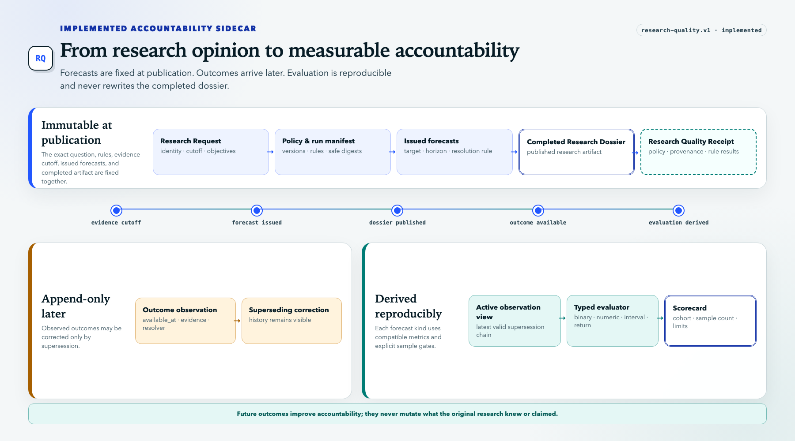

# Research Quality

- **Purpose:** define implemented policy provenance, forecast accountability, typed outcomes, and reproducible evaluation.
- **Audience:** domain designers, implementers, reviewers, and research readers.
- **Canonical for:** Research Quality semantics and interpretation boundaries.
- **Not canonical for:** investment performance or external certification.

[](../assets/architecture/research-quality.png)

[Open the full-resolution Research Quality design.](../assets/architecture/research-quality.png)

At completed publication, the request, policy identity, workflow/run manifest, dossier, issued forecasts, and Research Quality Receipt are immutable. Later outcome observations are append-only and may supersede earlier observations. Scorecards are reproducible derived artifacts and never mutate the completed dossier.

## Implemented boundary

`company-analytics.v1` publishes an immutable `research_quality.v1` receipt and explicit forecast set beside the unchanged research dossier. A durable quality store registers those records, appends typed outcome observations and corrections, and derives reproducible scorecards. CLI exposes `quality-outcome`, `quality-show`, and the read-only `quality-cohort --input <request.json>` evaluator; MCP exposes `record_research_outcome`, `get_research_quality`, and `evaluate_research_quality_cohort`.

The completed `CompanyAnalyticsResultV1` is authoritative and includes `research_quality.v1` and `forecast_set.v1` among its seven artifacts. The outcome index is a recoverable derived store: durable finalization stages it invisibly, publishes it after canonical completion, and reconstructs it from completed artifacts after an interrupted boundary. This is not a distributed transaction across stores.

## Bounded capability

Research Quality owns only:

- research-policy identity and deterministic rule results;
- safe run-manifest provenance;
- forecasts issued at publication;
- typed later outcome observations;
- decision-support status; and
- deterministic evaluation and scorecard artifacts.

It does not own retrieval, prompts, provider state, execution, portfolio mutation, or browser calculations.

## Records

### Research Quality Receipt

```text
policy_id · policy_version · policy_sha256
workflow_sha256 · request_sha256 · dossier_sha256
package/version identifiers · safe stage digests
typed rule results
```

The receipt is a distinct immutable artifact. It records the policy and safe provenance used to evaluate the run; it does not contain or replace the Completed Research Dossier.

Raw prompts, credentials, source bodies, and unrestricted tool arguments are prohibited.

### Forecast

Every scoreable forecast declares:

```text
forecast_id · run_id · instrument_id · claim_id
forecast_kind · target · forecast_at · information_cutoff_at
resolve_after · horizon · resolution_rule
probability | point_estimate | interval | direction
unit · benchmark_id · evidence_document_ids · producer provenance
```

Forecast kinds remain separate: binary event, numeric metric, interval/range, directional return, and benchmark-relative return.

Claim confidence, rating strength, or risk severity is never reinterpreted as a forecast probability.

`forecast_id` is globally namespaced and must begin with the exact `<quality_run_id>.` prefix. JSON Schema expresses record shape; strict Python validation enforces this cross-field relationship.

### Outcome Observation

```text
observation_id · forecast_id
observed_at · available_at · resolved_at
resolution_status
binary_outcome | numeric_outcome | realized_return
benchmark_return · outcome evidence · evaluator
supersedes_observation_id
```

Corrections append a superseding observation. Published history is not overwritten.

### Decision-support status

The quality gate uses explicit states:

- `supported`
- `insufficient_evidence`
- `conflicted`
- `policy_blocked`

A non-executable HOLD conclusion is distinct from insufficient or conflicting evidence.

## Implemented per-forecast evaluation

| Forecast kind | Current per-forecast metrics | Implemented input gate |
| --- | --- | --- |
| Binary event | Brier score, log loss | Resolved binary label and valid probability |
| Numeric metric | MAE, RMSE, signed bias | Resolved numeric value |
| Interval/range | Coverage and width | Defined interval and resolved numeric value |
| Directional return | Directional accuracy, realized return | Resolved realized return |
| Benchmark-relative return | Directional accuracy, relative return, benchmark return | Resolved realized and benchmark returns |

These remain individual-forecast scorecards. They do not calculate drawdown or adverse excursion, adjust for costs or corporate actions, or establish investment performance.

## Implemented binary cohort evaluation

`research-quality-cohort.v1` evaluates a fixed historical cohort of resolved `binary_event` forecasts. It is evaluation-only: it does not fit, train, tune, select, or deploy a calibration or machine-learning model.

The caller must supply an explicit evaluation cutoff, horizon, resolution rule, probability-bin edges, and a minimum sample size of at least 30. Every member must have a unique `forecast_id` and distinct `instrument_id`, use the same approved horizon and resolution rule, pass the per-forecast scoring policy, and have an active resolved outcome whose availability and resolution do not exceed the evaluation cutoff.

The deterministic report returns `evaluated`, `insufficient_sample`, or `policy_blocked`, together with sample size, mean Brier score, mean log loss, expected calibration error, bins, and explicit limitations. Thirty is a contract floor for running the summary, not evidence that a cohort is statistically representative or that the forecasts have investment skill.

## Leakage-safe evaluation

- Scored outcomes must have both `available_at` and `resolved_at` at or after the forecast's `resolve_after` boundary.
- Any training, fitting, or model-selection dataset must remain separate from this evaluator and must be available before the forecast being tested.
- The implemented binary evaluator requires distinct instruments and one explicit horizon and resolution rule; callers remain responsible for stronger issuer-family, temporal-window, and dataset-split controls when their study requires them.
- A historical retrieval cutoff alone does not prove a causal backtest: a contemporary model may encode information that post-dates the simulated decision. Unless the host provides an independently supportable model knowledge-cutoff declaration, label the result a **historically grounded simulation**, not a temporally pure or causal backtest.
- A caller claiming temporal purity must retain the model identifier/version and declared knowledge cutoff, plus retrieval, embedding/reranking, memory, and outcome-data cutoff receipts. The StockResearchAgents core records no provider credentials, prompts, or model weights and cannot independently verify those caller-owned claims.
- Licensed source bodies are not copied into evaluation datasets.
- Any future benchmark manifest must be content-addressed and retain policy/model/source versions.

## Viewer contract

The Research Dossier Viewer renders completed quality artifacts and, when available, outcome ledgers and scorecards. Scoring occurs in the StockResearchAgents service, not in browser JavaScript. The viewer never displays partial publication state or claims accuracy when observations are insufficient.

### Source-portfolio analysis

Every completed `RunView` now includes a deterministic `intelligence.source_analysis` projection. It keeps retained document records separate from reporting links embedded in evidence and reports each evidence axis independently:

- canonical, attributable, and unattributable document-record counts, where canonical requires both a safe web URI and a valid content digest;
- accessible, entitlement-blocked, and access-unknown counts; unknown access never qualifies as accessible;
- unique canonical URLs and declared content digests;
- retrieval-provider, publisher-label, and exact origin-host counts as separate concepts, with undeclared counts and no cross-field substitution;
- source identities resolved as connected components across exact digest/URI observations, with non-conflicting metadata merged, temporal candidates reduced to deterministic latest-usable and retrieval-range receipts, and conflicts retained explicitly rather than resolved by observation order;
- top-publisher concentration among publisher-attributed distinct records using an explicit greater-than-50-percent rule;
- unique accessible sources held against each declared coverage minimum and preferred source kind, deduplicated by exact digest or canonical URI;
- claim-to-document lineage, unique-source support, duplicate support references, counterevidence, and publisher/host diversity;
- separate linked-source status counts for opened/attributable, primary-confirmed, multi-source-confirmed, single-source-reported, discovery-only, unverified, and blocked/access-unknown items; and
- explicit gaps and the next missing source class.

Publisher and hostname diversity are observable proxies, not proof of editorial independence. The strict v1 `SourceDocument` contract has no ownership or editorial-control field, so the viewer reports `unsupported_by_research_contract`; it does not manufacture an independence assessment. A future versioned source-portfolio ownership/control receipt is required before that axis can be assessed. Discovery metadata such as GDELT publisher links remains distinct from an opened, attributable, and entitlement-checked source. The browser only renders this completed projection and never upgrades coverage or retrieves additional evidence.

The research projection internally retains `SourceDocument.publisher` in the historical `Provenance.provider` slot. Completed-view provider projections deliberately ignore that alias: the source-mix panel reports retrieval provider as undeclared until a real retrieval-provider receipt exists, while publisher remains available on its own axis. This preserves persisted run readability without presenting contradictory semantics.

This projection exposes current weaknesses but does not broaden retrieval. Better breadth requires the host to execute multiple explicit source routes, open discovery links where policy permits, retain separate child `SourceBatch` provenance and entitlement receipts, and publish an additive source-portfolio receipt. Heterogeneous provider batches must not be flattened into one misleading receipt, and paywalls or access controls must not be bypassed.

## Validation and remaining gates

Implemented tests cover strict contracts, deterministic scoring by forecast kind, validation, durable reload, correction supersession, CLI/MCP access, and completed-only projection.

Still required before fitting a calibration model or making performance claims:

1. sufficiently large and representative independently resolved cohorts beyond the evaluator's minimum contract floor;
2. separately approved, leakage-controlled training, validation, and holdout policies;
3. exact price conventions plus independently verified benchmark, corporate-action, and cost conventions where relevant;
4. long-running live-host evidence and outcome collection; and
5. explicit external evaluation criteria. Passing contract or cohort-evaluator tests is not evidence of investment skill.
