# Source portfolio

- **Purpose:** define how StockResearchAgents turns many retrieval attempts into a defensible, decision-relevant evidence portfolio.
- **Audience:** caller-runtime and adapter authors, reviewers, and maintainers.
- **Canonical for:** source-lane coverage, source independence, discovery-versus-evidence rules, and expansion priorities.
- **Not canonical for:** provider credentials, redistribution rights, or claims that live coverage is complete.

## Principle

The final dossier can display only the evidence the caller supplies. The viewer may deduplicate, expose concentration, and trace claims, but it must never manufacture source breadth. Collection therefore happens before terminal import; the UI is a completed projection of the resulting portfolio.

`No API key` is not a sufficient provider criterion. A default adapter also needs stable access terms, point-in-time semantics, provenance, bounded responses, redistribution rules, predictable failure behavior, and a validation receipt. Sources that do not meet those conditions remain caller-owned browser or connector integrations.

## Default portfolio

For a full company run, attempt every applicable lane:

| Lane | Preferred evidence | Independence rule |
| --- | --- | --- |
| Regulator | Annual, quarterly, current, proxy, amendment, ownership, and exhibit records | Multiple documents from one regulator are one provider family |
| Issuer | Earnings releases, presentations, prepared remarks, guidance, IR archive, legal and product notices | Authoritative for issuer statements, never independent corroboration |
| Market and fundamentals | Point-in-time prices, statements, ratios, estimates, liquidity, volatility, and valuation history | Keep provider, timestamp, adjustment, and entitlement lineage |
| Independent reporting | Opened articles from attributable publishers | Syndication and copied wire stories count once |
| Industry and peers | Competitor filings, customer or supplier disclosures, official industry data | Justify why each source changes the company analysis |
| Macro and policy | Central bank, statistics agency, regulator, trade, labor, commodity, or multilateral releases | Prefer primary observations and release vintages |
| Expectations and positioning | Entitled consensus, ratings, ownership, short interest, options, flows, and lawful social samples | Separate expectation, positioning, and sentiment from reported fact |
| Adversarial | Restatement, enforcement, litigation, audit, security, management, financing, concentration, and counter-thesis searches | Record negative searches and unresolved gaps, not just found evidence |

Normal initiating coverage targets the latest available evidence, at least five fiscal years and eight comparable quarters when available, at least three independent publisher domains, and at least two justified peers. These are coverage targets, not hard truth thresholds. If a lane is irrelevant or unavailable, record the attempt, reason, and decision impact instead of filling it with weak material.

## Retrieval sequence

```mermaid
flowchart LR
  accTitle: Research source retrieval sequence
  accDescr: A resolved instrument and exact cutoff drive discovery, attributable source opening, bounded normalization, deduplication, coverage checks, synthesis, and atomic completed-dossier publication.
  Q["Resolved instrument and exact cutoff"] --> D["Discovery batches"]
  D --> O["Open regulator, issuer, and publisher records"]
  O --> N["Normalize bounded observations and entitlement receipts"]
  N --> X["Exact dedup and near-duplicate clustering"]
  X --> C["Coverage, concentration, conflict, and gap checks"]
  C --> A["Claims, analytics, bull and bear synthesis"]
  A --> P["Atomic completed dossier publication"]
```

Search results and GDELT records are discovery batches. They become substantive evidence only after the caller opens the attributable underlying record and records permitted content, timestamps, provenance, and entitlement. A caller document opener should accept an opaque reference previously emitted by a discovery batch, not an arbitrary user URL.

## Identity and deduplication

Use exact matches in this precedence order:

1. same-scope content digest;
2. canonical URI;
3. provider-native immutable identifier.

Headline similarity, event similarity, or shared entities may cluster near duplicates but must not delete evidence. Preserve every provider and publisher attribution, the selected representative, and the reason for each exact duplicate or cluster. Conflicting values remain first-class evidence and must be reconciled or shown as unresolved.

## Current default adapters

The credential-free research-data MCP currently exposes seven receipt-backed public tools:

- SEC EDGAR regulatory filings, company facts, and statement facts;
- GDELT company and global news discovery metadata with publisher links;
- World Bank current-vintage macro observations; and
- Polymarket Gamma public search/read-only metadata for `prediction_markets`.

Use Polymarket only when a prediction market is decision-relevant. Its probabilities are current market-implied observations, not truth, forecasts, or executable signals. Gamma search cannot reconstruct a historical snapshot, and the adapter exposes no wallet, CLOB, order, position, or trading endpoints.

Prices and indicators require an injected entitled caller source; Yahoo Finance/`yfinance` remains caller-owned and subject to applicable terms rather than a default. Reddit requires approved caller-owned OAuth. StockTwits remains denied and unregistered. FRED and Alpha Vantage are not default providers. Licensed research services, including Seeking Alpha, may be used only through lawful caller access with explicit processing and redistribution rights. The Polymarket adapter does not close the licensed market-data or lawful social-provider gaps.

## Caller portfolio collection

`SourcePortfolioCollector` is the additive caller orchestration surface for source breadth. A caller registers explicit provider routes for a capability and the collector attempts every configured route instead of stopping after the first success. Each provider response remains an unchanged `SourceBatch` with its own provenance and entitlement; the collector never flattens differently licensed providers into one batch.

The versioned `SourcePortfolioReceipt` records every configured route attempt, sanitized failures, retained batch identities, exact duplicate clusters, provider families, coverage status, and explicit gaps. Route IDs are caller-configured identities, while provider claims remain in each batch's provenance. The receipt exposes unique route-qualified `source_batch_ids` for the run card even when two routes return byte-identical batches. Exact deduplication is referential: matching observations remain in their original batches, while the receipt names a deterministic representative. Matching precedence is same-scope content digest, canonical URI, then provider-family/native identity.

This collector does not make a provider available by itself. The credential-free MCP default remains SEC, GDELT, World Bank, and Polymarket Gamma. Reddit, entitled market data, issuer publications, document opening, and other sources still require separately validated caller adapters. The receipt can populate the existing run-card batch IDs and source-lineage bindings; publishing the complete attempt/dedup receipt as a terminal typed artifact remains a versioned contract follow-up.

## Expansion order

1. Correct identity, bounds, timestamps, completeness, and dedup semantics in existing SEC and GDELT adapters.
2. Add an issuer-publications metadata capability for approved issuer IR domains, RSS/Atom feeds, and sitemaps.
3. Add an optional caller-owned public-document opener restricted to opaque references from prior discovery batches, with strict domain, redirect, MIME, size, robots, and entitlement policy.
4. Add official macro providers independently, each with its own vintage and validation semantics; never silently merge them into one provenance record.
5. Add licensed market, consensus, transcript, positioning, and social adapters only with caller-owned credentials and adapter receipts.
6. Publish the implemented caller source-portfolio receipt as a versioned terminal artifact and bind its attempted batches, retained observations, coverage, dedup decisions, and gaps to the run card and source-lineage crosswalk.

## Completion rule

A dossier is research-complete only when its declared decision-relevant lanes are either covered or explicitly gap-receipted. It is never described as exhaustive web coverage. The completed viewer must show freshness, source families, publisher/host concentration, duplicate clusters, entitlement limits, conflicts, uncited claims, and missing lanes prominently enough that a reader can judge the result without inspecting internal state.
