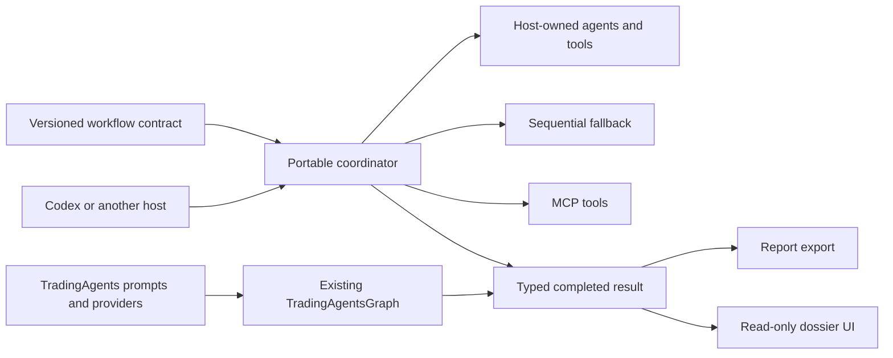

# RFC: harness-neutral TradingAgents integrations

Status: proposal for upstream discussion

Upstream: [TauricResearch/TradingAgents](https://github.com/TauricResearch/TradingAgents)

Prototype: [harshitagarwal2/StockResearchAgents](https://github.com/harshitagarwal2/StockResearchAgents)

Upstream discussion: [TauricResearch/TradingAgents#1198](https://github.com/TauricResearch/TradingAgents/issues/1198)

## Summary

TradingAgents has a complete multi-agent research workflow, but its workflow
semantics are currently consumed primarily through the standalone CLI and the
LangGraph runtime. This RFC proposes a portable integration boundary so Codex,
MCP clients, and other agent harnesses can run the same observable research
topology without copying TradingAgents business logic or forcing every host to
embed LangGraph.

The recommended split is:

- TradingAgents remains the source of truth for roles, production prompts,
  provider and data-vendor clients, and the legacy LangGraph executor;
- a small versioned workflow contract describes observable stages, ordering,
  allowed tool capabilities, state, evidence, and result schemas;
- an optional MCP surface exposes credential-free coordination, validation,
  lifecycle, export, and completed-result tools;
- each host owns model inference, agent spawning, concrete tools,
  authentication, and hard interruption;
- harness-specific skills and plugins remain thin adapters outside the
  portable core;
- the final UI is a read-only projection of a completed result, not another
  workflow engine.

The existing LangGraph and CLI paths would remain supported. This proposal is
about adding an integration seam, not replacing the current application.

## Motivation

The TradingAgents research flow has useful meaning beyond one runtime:

1. selected market, social, news, and fundamentals analysts gather evidence;
2. bull and bear researchers debate for a configured number of rounds;
3. the Research Manager synthesizes the debate;
4. the Trader produces an analytical proposal;
5. aggressive, conservative, and neutral risk roles debate;
6. the Portfolio Manager produces the terminal decision.

Today a downstream integration can either delegate the whole run to
`TradingAgentsGraph` or reproduce this behavior in its own orchestration code.
The first option couples the host to the legacy runtime and its model/provider
configuration. The second risks workflow drift and duplicated business logic.

A stable, typed contract between workflow meaning and runtime mechanics would
let different harnesses preserve the same user-visible stages and report groups
while using their own agents and tools.

## Goals

- Preserve the observable TradingAgents research topology, configured debate
  depths, evidence lineage, decisions, and report groups across runtimes.
- Keep the current LangGraph executor and CLI behavior backward compatible.
- Allow a host such as Codex to use its own authenticated thread, agents, and
  tools without passing model API keys through the portable boundary.
- Support hosts with subagents, hosts with only one sequential agent, and
  tools-only MCP consumers.
- Give downstream integrations a versioned compatibility target and an
  explicit upstream revision to test against.
- Keep lifecycle controls, result publication, and the final UI independent of
  a particular agent harness.

## Non-goals

- Replacing LangGraph inside the existing TradingAgents application.
- Guaranteeing identical generated text across models or harnesses.
- Moving provider credentials, OAuth state, raw prompts, transcripts, or tool
  arguments through the portable contract.
- Adding broker or order-execution authority.
- Copying or forking upstream prompts, agents, provider clients, or data-vendor
  implementations.
- Reproducing terminal pixels in a browser. Feature parity means comparable
  research information and actions, not an identical renderer.

## Proposed architecture



### Portable contracts

The portable layer would define versioned schemas for:

- run request and selected analysts;
- workflow stages and dependency order;
- stage context, allowed tool capabilities, and output shape;
- evidence and provenance;
- research, trading, risk, and portfolio decisions;
- lifecycle events and safe execution receipts;
- the completed result and report bundle.

The minimum harness-facing interface is conceptually:

```python
run_agent(role, instructions, context, allowed_tools) -> StageResult
call_tool(name, arguments) -> ToolResult
save_state(run_id, state) -> None  # optional
```

The interface specifies required meaning, not how a host creates agents.
LangGraph can map stages to nodes, Codex can map them to native tasks or
subagents, and a generic executor can run stages sequentially with one agent.

### Capability negotiation

The same workflow should support three modes:

| Mode | Host capability | Behavior |
| --- | --- | --- |
| Full | Subagents, parallel tools, structured output | Separate roles and parallelizable analyst work |
| Compatible | One agent plus tools | The same stages execute sequentially |
| Tools-only | MCP calls | The harness performs orchestration itself |

The report contract is shared across modes. Exact model output, token
accounting, hard interruption, and push delivery remain host-specific.

### Ownership boundary

| Concern | Proposed owner |
| --- | --- |
| Production prompts and agent behavior | TradingAgents |
| Provider and market-data clients | TradingAgents |
| Existing LangGraph execution | TradingAgents |
| Workflow topology and typed portable schemas | Shared upstream contract or a small integrations package |
| Agent spawning and model inference | Host harness |
| Concrete tools and authentication | Host harness |
| Portable checkpoints and result publication | Portable coordinator |
| Codex skill/plugin metadata | External adapter |
| Completed-result UI | External adapter or optional integration package |

## Existing prototype

The independent prototype demonstrates the proposed boundary without changing
the upstream repository. It currently includes:

- a versioned workflow manifest and typed request, lifecycle, evidence,
  decision, result, and dashboard contracts;
- the complete declared analyst, bull/bear, manager, trader, three-way risk,
  and portfolio topology;
- a host-native stage lifecycle with durable stage-boundary resume,
  cooperative cancellation, safe receipts, and atomic result publication;
- a generic sequential executor for harnesses without subagents;
- a 27-tool credential-free MCP surface plus Codex skill/plugin metadata;
- an optional thin adapter that delegates legacy execution to the pinned
  upstream `TradingAgentsGraph` rather than copying its implementation;
- an upstream-compatible report export and a completed-result-only dossier UI;
- a pinned upstream revision and a weekly workflow that tests proposed pin
  updates before opening a review PR.

Credential-free conformance, package, CLI, MCP, lifecycle, persistence, export,
and UI behavior are covered by the prototype test suite. A real credentialed
upstream provider run, exact generated-text equivalence, upstream-owned
checkpoint resume, and live legacy stage streaming are not claimed as verified.

Current evidence:

- `219 passed` against pinned upstream revision
  `a33fd4c0f134485a43553a2c23a63cb14adbd88f`;
- [full CI run](https://github.com/harshitagarwal2/StockResearchAgents/actions/runs/30797921465);
- [upstream no-change sync check](https://github.com/harshitagarwal2/StockResearchAgents/actions/runs/30798041036).

## Suggested contribution sequence

### Phase 1: agree on the boundary

- Review this RFC in an upstream issue.
- Decide whether the portable contract belongs upstream, in a separately
  released integrations repository, or remains an independent community
  project.
- Agree on which behaviors are compatibility invariants and which remain
  runtime-specific.

### Phase 2: small design and contract PR

- Add a design document and versioned schemas only.
- Add conformance tests for stage ordering, round counts, evidence references,
  decision shapes, and report groups.
- Do not change the existing CLI or LangGraph defaults.

### Phase 3: optional integration surface

- Add a generic executor interface and, if desired by maintainers, a small MCP
  package or server.
- Keep dependencies optional and imports isolated from the existing runtime.
- Retain the current LangGraph executor as the backward-compatible reference
  adapter.

### Phase 4: harness adapters

- Keep Codex and other product-specific skills/plugins in external packages or
  dedicated integration directories.
- Test every adapter against the same contract suite.
- Pin and regularly test the upstream revision; never auto-merge upstream pin
  updates.

## Repository-placement options

### Option A: thin contract upstream, adapters external (recommended)

TradingAgents owns the portable workflow schemas and conformance rules. MCP,
Codex, browser UI, and other harness adapters stay in the independent
repository. This gives downstreams a stable contract without adding product-
specific dependencies to the core project.

### Option B: all integrations external

The prototype remains a community project and pins upstream revisions. This has
the smallest upstream maintenance cost, but the compatibility contract can
still drift unless maintainers endorse or review its observable invariants.

### Option C: optional integrations package upstream

TradingAgents adds a dependency-isolated `integrations` or `mcp` package. This
provides first-party discoverability, but increases release, compatibility, and
support responsibilities for the upstream maintainers.

## Compatibility and update strategy

- Pin an exact upstream commit rather than tracking a moving branch at runtime.
- Run credential-free conformance against the pinned checkout in CI.
- Check upstream `main` on a schedule and open a review PR only after the full
  test suite passes.
- Never auto-merge an upstream update.
- Record verified portable behavior separately from credentialed live-runtime
  behavior.
- Avoid vendoring upstream source; use a thin adapter for legacy delegation.

## Questions for maintainers

1. Is a harness-neutral contract for the existing multi-agent research workflow
   in scope for TradingAgents?
2. Would you prefer Option A, B, or C for repository ownership?
3. If a contribution is welcome, should the first PR contain only the design
   document, schemas, and conformance tests?
4. Which behaviors should be treated as upstream compatibility invariants:
   topology and round counts, prompts, state keys, report groups, or another
   boundary?
5. Should MCP remain entirely external, or would an optional credential-free
   tool server be useful upstream?
6. Are there naming, package-layout, or PR-granularity preferences before code
   is proposed?

The implementation can be reshaped around maintainer guidance. The intent is
to avoid presenting a large integration PR before the project agrees on the
boundary.
