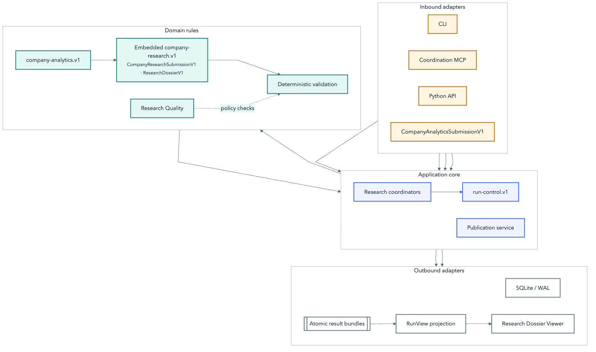
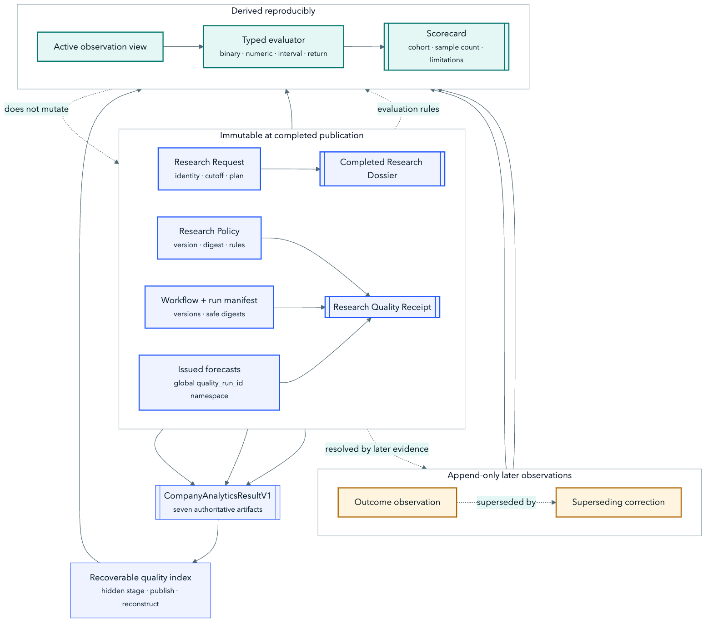

# Architecture diagram sources

## Purpose

This directory is canonical for the Mermaid sources behind the rendered architecture diagrams in `assets/architecture/`.

## Rendering

Run:

```bash
./scripts/render_architecture_diagrams.sh
```

The script pins Mermaid CLI so the repository does not gain a Node runtime dependency. Commit the `.mmd` source plus regenerated `.svg` and `.png` outputs in the same change. GitHub-facing Markdown embeds the PNG preview and links it to the full-resolution SVG. A raw `.mmd` file is source text on GitHub; GitHub renders Mermaid only when the diagram is inside a supported fenced `mermaid` block.

The checked-in Puppeteer configuration uses the standard macOS Google Chrome path. On another platform, override `executablePath` locally or use Mermaid CLI's bundled browser installation before rendering.

## Diagram grammar

- Solid arrows carry immutable or validated data.
- Dashed arrows are queries, references, or caller-declared relationships.
- Double-bordered nodes are completed immutable artifacts.
- Diamonds are real validation or publication gates.
- Cobalt identifies interfaces, aqua verified state, amber incomplete state, and red rejected or prohibited state.
- Labels, shapes, and line styles carry meaning; color never stands alone.

Every source must include `accTitle` and `accDescr`. Every rendered diagram must be followed by a textual explanation in its owning document.

The technical diagram set intentionally separates four questions that are easy to conflate:

- `system-context`: who owns each authority boundary;
- `portable-components` and `solid-ports-adapters`: where the StockResearchAgents core, dependencies, and extension seams live;
- `source-to-dossier`: how caller-supplied evidence becomes a completed typed artifact; and
- `company-analytics-lifecycle`, `completed-publication`, and `research-quality-lineage`: when state can advance, become visible, or be evaluated later.

## GitHub preview gallery

The previews below are PNGs so they remain visible in browsers where GitHub does not render SVG. Select any preview for its full-resolution SVG, or open the Mermaid source to inspect the editable diagram-as-code.

### System context

[](../../assets/architecture/system-context.svg)

[Mermaid source](system-context.mmd)

### StockResearchAgents core components

[](../../assets/architecture/portable-components.svg)

[Mermaid source](portable-components.mmd)

### SOLID ports and adapters

[](../../assets/architecture/solid-ports-adapters.svg)

[Mermaid source](solid-ports-adapters.mmd)

### Evidence to dossier

[](../../assets/architecture/source-to-dossier.svg)

[Mermaid source](source-to-dossier.mmd)

### Durable Company Analytics lifecycle

[](../../assets/architecture/company-analytics-lifecycle.svg)

[Mermaid source](company-analytics-lifecycle.mmd)

### Completed-only publication

[](../../assets/architecture/completed-publication.svg)

[Mermaid source](completed-publication.mmd)

### Research Quality lineage

[](../../assets/architecture/research-quality-lineage.svg)

[Mermaid source](research-quality-lineage.mmd)
